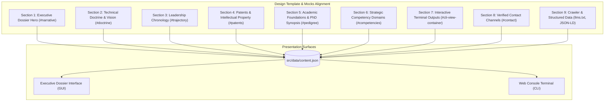

# Master Full Text Content Specification: Kirill Lebedev, PhD

**Feature**: `001-personal-brand-website`  
**Step**: Step 2 (Full Text Content Generation — First-Person Narrative Edition)  
**Task**: `T004`  
**Date**: 2026-10-07  
**Status**: Revised with 1st-Person Storytelling, Design Alignment, and PhD Thesis Integration  
**References**: [resume.pdf](file:///mnt/data/ws/drlebedev.com/specs/001-personal-brand-website/content/resume.pdf) | [resume.md](file:///mnt/data/ws/drlebedev.com/specs/001-personal-brand-website/content/resume.md) | [thesis.pdf](file:///mnt/data/ws/drlebedev.com/specs/001-personal-brand-website/content/thesis.pdf) | [key-messages.md](file:///mnt/data/ws/drlebedev.com/specs/001-personal-brand-website/content/key-messages.md)

---

## Content Architecture & Design Alignment

This master document provides the complete, production-ready copy for drlebedev.com.
All copy is written in an authentic **first-person ("I", "my") storytelling voice** that reflects Kirill Lebedev's philosophical depth, systems engineering rigor, and executive leadership.
The structure directly maps to the design sections in `mocks/stitch-dark.html` and `mocks/stitch-light.html`.



---

## 1. Executive Dossier Hero & Core Identity (`#narrative`)

### 1.1 Meta Identifiers & Header
- **Full Professional Name**: Kirill Lebedev, PhD
- **Primary Executive Title**: Director of Engineering | AI & Ads Measurement Leader
- **Location**: SF Bay Area
- **Verified Email**: `kirill@drlebedev.com`
- **Phone**: `+1 (415) 799-9995`
- **LinkedIn**: `https://www.linkedin.com/in/drlebedev/`
- **Website**: `https://www.drlebedev.com`
- **Resume Download**: `/assets/drlebedev-resume.pdf`
- **Thesis Download**: `/assets/download/thesis.pdf`

### 1.2 Eyebrow & Live Telemetry Badge
- **Eyebrow**: `SF BAY AREA • ENGINEERING HEAD OF ADS MEASUREMENT & ATTRIBUTION @ LINKEDIN`
- **Status Beacon**: `ACTIVE USPTO INVENTOR • 40–70+ SCIENTIFIC & ENG ORG`

### 1.3 Personal Credo & Visionary Hero Quote
> *"I have always believed that real engineering breakthroughs do not come from chasing trends. They come from understanding the fundamentals so deeply that you can see where reality is heading before anyone else. When you build from first principles—whether in mathematics, distributed systems, or artificial intelligence—you don't just follow industry waves. You build the bedrock they ride on."*

### 1.4 First-Person Lead Narrative (Drop-Cap Story)
I lead engineering organizations that bridge foundational computer science with massive commercial scale. Throughout my career, I have dedicated myself to turning emerging technologies—from causal inference and differential privacy to high-throughput machine learning—into dependable platforms and multi-billion-dollar business lines.

At LinkedIn, as Director of Engineering and overall Ads Measurement leader, I direct a 40–70+ person full-stack organization across Audience, Identity, Incrementality, Recommendations, and Measurement. I spearheaded the grassroots initiative that bootstrapped our Brand Advertising business line from zero into an enterprise engine generating over $1B in annual revenue (~20% of total ad revenue). Serving as the Engineering DRI for our AI Ads Audience products, I brought together engineering, product, and sales teams to build our next-generation AI advertising solution, accelerating revenue 6x to $100M ARR within just six months.

Beyond revenue milestones, my focus has always been on technical depth, engineering craft, and institutional governance. As a multi-year member of company-wide hiring committees, I calibrate senior technical talent and set the bar for engineering leadership. My work is anchored in deep academic roots: I hold a PhD in Computer Science, graduated Summa cum laude in Systems Engineering and Low-Level System and Software Design, served as university Professor and Deputy Vice-Rector, and hold three issued US patents in on-device experimentation and dynamic content platforms.

### 1.5 Monolithic Three-Pillar Metric Bar
- **Metric 1**: `$1B+` — *Brand Advertising Business Line Bootstrap*
- **Metric 2**: `$100M+ ARR` — *AI Ads Solution in 6 Months (6x Growth)*
- **Metric 3**: `40–70+` — *Full-Stack Scientific & Engineering Organization*
- **Supporting Metric**: `25%` — *Total Ad Revenue Covered by Incremental Measurement*

---

## 2. Technical Doctrine & Visionary Thesis (`#doctrine`)

### 2.1 Chapter I: Executive Thesis — "Truth in Measurement at Hyperscale"
The multi-billion-dollar monetization engine of the modern digital economy depends not merely on ad inventory liquidity, but on the integrity of advertiser truth.

Over the past decade, digital ad measurement underwent tectonic structural disruption. Platform tracking barriers, European regulatory mandates, and the global demise of third-party cookies eradicated traditional client-side last-touch attribution. What had historically been a tracking exercise transformed abruptly into a profound econometric challenge: how do you infer true incrementality when signals are deliberately masked, aggregated, and differentially noisy?

In my organization at LinkedIn, we answered this challenge by replacing obsolete heuristic tracking with rigorous mathematical foundations: Bayesian causal inference, synthetic controls, and privacy-preserving data architectures. Instead of viewing privacy constraints as limitations, we treated them as an engineering boundary condition. By consolidating outcomes infrastructure, eliminating differential privacy noise, and providing mathematically verifiable causal lift, we transformed signal loss into a strategic moat that powers enterprise advertiser trust across the globe.

### 2.2 The Three Pillars of Technical Doctrine

#### Doctrine 01: Bayesian Causal Inference & Account-Based Marketing
> *"Heuristic last-touch models misallocate significant capital toward organic converters. In our systems, we isolate selection bias from true ad intervention using Bayesian incrementality and company-level audience splits."*

In advertising, correlation is not causation. If an advertiser was going to buy anyway, claiming attribution for that conversion is an illusion. I architected our incrementality systems to measure true economic causality across 25% of LinkedIn's total advertising revenue. By deploying Bayesian calculation, company-level audience splitting, and frequency-aware sampling, we prove an incremental impact for enterprise adopters with mathematical certainty.

#### Doctrine 02: Differential Privacy & Privacy-Safe Signal Consolidation
> *"In advertising, as in physics: if your measurement instruments distort what they observe, your conclusions are worthless. We extract signal from noise while preserving mathematical privacy."*

Regulatory barriers require cross-entity analytics without exposing raw personal data. I directed the comprehensive overhaul of LinkedIn's outcomes infrastructure, unifying Conversions API (CAPI) with privacy-safe cryptographic compute and differential privacy noise reduction in a new version of attribution platform. We ensure strict mathematical privacy guarantees without destroying the statistical utility of conversion signals.

#### Doctrine 03: Scaled Identity Graph & Pairwise Multi-Source Resolution
> *"An advertising platform is only as coherent as its understanding of identity. By resolving fragmented signals into a unified graph, you turn disconnected events into actionable enterprise intelligence."*

Modern measurement and targeting collapse when identity is fractured across devices, browsers, and enterprise ecosystems. I directed the architecture of our identity graph infrastructure that ingests and resolves pairwise observations from both 1st-party platform signals and 3rd-party data providers at scale. By reconciling deterministic and probabilistic link graphs while preserving strict privacy enclaves, our platform establishes high-fidelity entity resolution that powers accurate audience targeting, frequency control, and robust causal attribution across the entire monetization ecosystem.

---

## 3. Leadership Dossier & Executive Chronology (`#trajectory`)

### 3.1 LinkedIn | SF Bay Area (2016 – Present)

#### Director of Engineering (Mar 2024 – Present)
*Overall Ads Measurement Leader • 40–70+ Person Full-Stack Organization*
- **My Mission & Scope**: I own the complete business, technological, and talent strategy for a 40–70+ person organization spanning five core charters: Audience, Identity, Incrementality, Recommendations, and Measurement. I lead a senior leadership bench of managers and Senior Staff Engineers, direct bi-annual business planning, and represent engineering in corporate M&A technical evaluations.
- **AI Ads Acceleration ($100M ARR)**: As Engineering DRI, I unified Product, Design, Data Science, PMM, and Sales teams to build LinkedIn’s AI-powered ads solution (LinkedIn Accelerate), driving 6x revenue expansion to $100M ARR in six months.
- **Outcomes Infrastructure Overhaul**: I strategically revamped our outcomes infrastructure, consolidating conversion signals, mitigating differential privacy noise, and ensuring global privacy compliance.
- **Enterprise Incrementality (25% Ad Revenue)**: I championed B2B company-level measurement covering 25% of total ad revenue, validating a 2x incremental spend increase for adopters through Bayesian calculation and company-level audience splitting.
- **AI-Native Engineering Transformation**: I spearheaded our organization-wide developer transformation, targeting a 2X engineering productivity boost through AI tooling.
- **Corporate Hiring Governance**: I serve as an active, multi-year member of company-wide hiring committees, evaluating Apps/UI, distributed systems, and technical leadership candidates.

#### Senior Engineering Manager (Sep 2020 – Mar 2024)
*Head of Engineering for Brand Advertising • Scaled Org from 18 to 40*
- **Bootstrapping the $1B+ Business Line**: I championed a grassroots initiative that grew from an idea into an enterprise business generating over $1B annually (~20% of total LinkedIn ad revenue). I led the creation of the end-to-end product suite: Reach & Frequency optimization, Brand Lift measurement (BLT), and modern Media Planning tools that unlocked expansion into CTV and live events.
- **Strategic 3rd-Party Measurement ($500M Scale)**: I partnered with BizDev to pioneer privacy-first incrementality measurement with Nielsen, Kantar, and Dynata, scaling to $500M.
- **CEO Business Forecasting Engine**: I partnered with FP&A to build the company-wide revenue forecasting platform used daily for the CEO’s executive report.
- **Organizational Craft & Operational Excellence**: I created a two-layer management structure, promoted key leads, and instituted engineering excellence initiatives that cut bug introduction by 75% and alert volume by 70%.

#### Engineering Manager (Jul 2018 – Sep 2020)
*Head of Engineering for Advertiser A/B Testing & Ads Forecasting • Scaled Team 5 to 15*
- **First Advertiser A/B Testing Platform**: I architected and launched LinkedIn's first advertiser-facing experimentation platform, collaborating with Data Science, Product, and Design to deliver a GA product that improved advertiser ROI by an average of 40%.
- **Advertiser Recommendations ($20M ARR)**: I re-chartered our forecasting team to build an AI-driven advertiser recommendations product, generating ~$20M in incremental annual revenue with sustained 2–3x YoY adoption over 7 years.
- **Talent Development**: I mentored and promoted multiple engineers to the Staff Software Engineer level.

#### Staff Software Engineer (2016 – 2018)
*Technical Lead for Platform Integrity & Content Review*
- **ML Platform for Platform Integrity**: I architected and delivered LinkedIn’s first machine-learning system for automated ad content review, reducing manual review workload by 90% and cutting ad-related member escalations by 80% through direct user feedback loops.

---

### 3.2 Organizer Inc. | SF Bay Area (Nov 2012 – Jul 2016)
#### Chief Software Engineer
*Real-Time Mobile & Cloud Canvassing Platform • 15+ Onsite & Offshore Engineers*
- **Real-Time Field Architecture**: I directed the end-to-end design and implementation of a real-time political canvassing system, including native Android and iOS mobile applications backed by Google Cloud Platform and BigQuery high-throughput analytics.
- **Mission-Critical 24/7 Operations**: I ensured 24/7 reliability for high-profile political campaigns across the US, including the Ed Lee San Francisco mayoral campaign and the 2016 Hillary Clinton presidential campaign.
- **Quality & Craft Transformation**: I managed engineering craft for 15+ engineers, reducing our bug introduction rate by 80% through automated testing and continuous integration.

---

### 3.3 i.Point LLC | Irkutsk, Russia (Jan 2002 – Nov 2021)
#### Co-Founder & Chief Technology Officer (CTO)
*Enterprise Web & Mobile Software Company • Scaled to 20+ Engineers*
- **Company Building & Operations**: I co-founded the company, scaled our engineering organization to 20+ professionals, established our software development lifecycle, and managed technology budgeting and hardware provisioning.
- **Complex Project Delivery**: I served as technical strategy lead and chief architect for the successful delivery of 10+ major enterprise client projects and web portals.

---

### 3.4 Irkutsk National Research Technical University (Sep 2004 – Jan 2012)
#### Deputy Vice-Rector / Professor
*University Internet Technology Center • Academic Faculty*
- **Campus-Wide Digital Infrastructure**: I managed the University Internet Technology Center, overseeing team operations, deploying an online learning management system with 300+ courses, and leading university web platforms through 3 full redesigns and 2 infrastructure migrations.
- **Professor of Computer Science**: I taught university undergraduate and graduate courses in Software Engineering, Operating Systems, and Statistics & Probability Theory.

---

## 4. Issued United States Patents & Intellectual Property (`#patents`)

I have always believed that intellectual property should represent genuine architectural breakthroughs that solve difficult physical and computational constraints:

### 4.1 US Patent 11,968,185: On-Device Experimentation
- **Grant Date**: April 23, 2024
- **USPTO Verified URL**: `https://patents.google.com/patent/US11968185`
- **Architectural Motivation**: Traditional A/B testing relies on server round-trips that introduce network latency and leak user telemetry. I invented a system allowing mobile and client devices to locally execute randomized treatment assignments, collect telemetry in cryptographic buffers, and perform privacy-preserving statistical inference directly on-device.
- **Business Impact**: Powers client-side experimentation and privacy-safe measurement across massive user bases with zero server latency.

### 4.2 US Patent 11,232,254: Editing Mechanism for Electronic Content Items
- **Grant Date**: January 25, 2022
- **USPTO Verified URL**: `https://patents.google.com/patent/US11232254`
- **Architectural Motivation**: Delivering personalized, multi-variant digital content across distributed surfaces requires dynamic composition without sacrificing rendering speed or structural integrity. I formulated an algorithmic framework for runtime structural validation and dynamic layout adaptation.
- **Business Impact**: Serves as the structural foundation for automated ad creative generation and real-time content optimization.

### 4.3 US Patent 11,102,534: Content Item Similarity Detection
- **Grant Date**: August 24, 2021
- **USPTO Verified URL**: `https://patents.google.com/patent/US11102534`
- **Architectural Motivation**: Evaluating billions of digital ad items for copyright compliance and policy violations cannot be done with brute-force comparisons. I invented a scalable similarity detection system using locality-sensitive hashing and high-dimensional vector embeddings capable of sub-millisecond similarity matching.
- **Business Impact**: Core engine for automated ad content review and duplicate creative suppression at enterprise scale.

---

## 5. Academic Foundations & PhD Thesis Synopsis (`#pedigree`)

My engineering philosophy is rooted in rigorous academic training and first-principles mathematical thinking.

### 5.1 Doctor of Philosophy (PhD) in Computer Science (2004 – 2008)
- **Institution**: Irkutsk National Research Technical University (INRTU)
- **Specialty Code**: `05.13.11` – Mathematical and Software Support of Computing Machines, Complexes and Computer Networks
- **Dissertation Title**: *Development of a method and tools for creating applications for a website content management system* (*Разработка метода и инструментальных средств создания программного обеспечения для системы управления содержанием веб-сайтов*)
- **Original Document**: Preserved on drlebedev.com as [`thesis.pdf`](file:///mnt/data/ws/drlebedev.com/specs/001-personal-brand-website/content/thesis.pdf)

#### Core Scientific Contributions from My Thesis:
1. **Multilevel System Design & Quality Methodology**:
   I developed a unified multilevel engineering framework for web content systems (i.Portal) that integrates formal architectural specification, automated code generation, and quality management compliant with international software standards.
2. **Model-Driven Architecture (MDA) & Automated Scaffolding Generation**:
   I created an automated software generator using formal UML and Eclipse EMF (Ecore) models. By generating application code skeletons directly from verified architectural models, this system drastically reduced component-level architectural defects before writing custom code.
3. **Dynamic Structured Metadata Storage Model**:
   I invented a relational persistence technology allowing dynamic management of structured metadata. This allows applications to evolve data schemas and entity relationships at runtime without requiring code refactoring or schema migrations.
4. **Modular i.Portal Kernel Architecture**:
   I architected a modular component framework based on strict separation of concerns across six foundational abstractions:
   - *Factories*: Encapsulate data persistence and business logic.
   - *Modules (`ModuleSupport`)*: Generate active dynamic HTML content.
   - *Services*: Headless background operations invoked across system components.
   - *Sites*: Kernel-level multi-tenancy hosting multiple virtual web portals on a single runtime.
   - *Themes & Layouts*: Decoupled visual presentation adhering strictly to Model-View-Controller (MVC) principles.
5. **Industrial & Academic Production Validation**:
   My platform was deployed in production to power the regional university portal and distance learning platform supporting 300+ courses.

### 5.2 Master of Engineering / Degree in Computer Science (1999 – 2004)
- **Institution**: Irkutsk National Research Technical University (INRTU)
- **Honors**: **Summa cum laude** (GPA 5.0 / 5.0)
- **Academic Major**: Systems Engineering and Low-Level System and Software Design
- **Academic Minor**: Software Engineering

### 5.3 University Faculty & Teaching Tenure
- **Academic Rank**: Deputy Vice-Rector / Professor (2004 – 2012)
- **Courses Taught**: Operating Systems, Software Engineering, Statistics & Probability Theory

---

## 6. Strategic Competencies & Systems Philosophy (`#competencies`)

### 6.1 Executive Leadership, Strategy & Governance
- **Hiring Committee Leadership**: Multi-year tenure on company-wide hiring committees calibrating Staff/Principal engineering and leadership talent.
- **Organizational Architecture**: Designing and scaling 40–70+ person full-stack engineering organizations; establishing two-layer management hierarchies.
- **Strategic Governance**: Capital planning, hardware budget allocation, and executive representation in corporate M&A technical evaluations.
- **AI-Native Developer Transformation**: Upleveling engineering workflows to unlock a 2X productivity boost.

### 6.2 AdTech Product Incubation & Monetization (0 to 1)
- **$1B+ Business Line Bootstrap**: Incubating grassroots ideas into massive enterprise revenue engines (~20% of total ad revenue).
- **Accelerated AI Commercialization**: Driving AI Ads solutions to $100M ARR in six months (6x growth).
- **Causal Measurement at Scale**: Covering 25% of total ad revenue with Bayesian incrementality, validating 2x spend expansion.
- **Media Optimization**: Reach & Frequency optimization, Connected TV (CTV) expansion, and $500M 3rd-party incrementality partnerships (Nielsen, Kantar, Dynata).

### 6.3 Artificial Intelligence & Machine Learning
- **Applied AI Strategy**: Embedding complex models into high-throughput client-facing platforms.
- **Causal Inference**: Bayesian probability, counterfactual modeling, and frequency-aware sampling.
- **Platform Integrity**: Deploying machine learning for automated content review to cut manual review workloads by 90%.
- **Predictive Systems**: AI-driven advertiser recommendations generating ~$20M in annual revenue.

### 6.4 Distributed Systems & Cloud Platforms
- **Cloud-Native Architecture**: High-scale distributed architectures across Microsoft Azure, Google Cloud Platform & BigQuery, and Google App Engine.
- **Event Streaming**: Sub-10ms P99 real-time event processing and telemetry pipelines.
- **Mobile Systems**: Native Android and iOS system engineering and real-time client synchronization.
- **Backend Languages**: Scalable distributed backends in Java & Scala, and Python.

---

## 7. Web Console Terminal (CLI) Outputs (`#cli-view-container`)

These exact first-person text blocks are rendered in the interactive terminal console:

### 7.1 `help` Command Output
```text
======================================================================
  KIRILL LEBEDEV, PhD — INTERACTIVE WEB CONSOLE
======================================================================
Available commands:
  help       - Display this list of available commands
  bio        - View my executive background, personal credo, and story
  exp        - View my leadership chronology and career milestones
  patents    - List my issued United States patents and USPTO links
  edu        - View my academic major, doctoral thesis, and honors
  skills     - View my competency matrix across leadership, AI, and systems
  contact    - View my verified direct communication channels
  gui        - Switch display to the Executive Dossier graphical interface
  clear      - Clear the console screen buffer
======================================================================
```

### 7.2 `bio` Command Output
```text
======================================================================
  EXECUTIVE DOSSIER: KIRILL LEBEDEV, PhD
  Director of Engineering | AI & Ads Measurement Leader
======================================================================
"I have always believed that real engineering breakthroughs do not
come from chasing trends. They come from understanding the fundamentals
so deeply that you can see where reality is heading before anyone else.
When you build from first principles—whether in mathematics, distributed
systems, or artificial intelligence—you don't just follow industry
waves. You build the bedrock they ride on."

Overview:
• Director of Engineering at LinkedIn; overall Ads Measurement leader.
• Lead 40-70+ person full-stack organization across 5 core charters.
• Bootstrapped Brand Advertising from 0 to 1 to $1B+ in annual revenue.
• Engineering DRI for AI Ads products: 6x growth to $100M ARR in 6 mo.
• Multi-year member of company-wide hiring committee.
• PhD in Computer Science | Summa cum laude | 3 Issued US Patents.
• Location: SF Bay Area
======================================================================
```

### 7.3 `exp` Command Output
```text
======================================================================
  PROFESSIONAL LEADERSHIP CHRONOLOGY
======================================================================
[2024 - PRESENT] LINKEDIN • SF Bay Area
Director of Engineering (Ads Measurement Leader)
• Lead our 40-70+ person full-stack organization (UI, Data, AI).
• Engineering DRI for AI Ads products: scaled 6x to $100M ARR in 6 mo.
• Revamped outcomes infrastructure; eliminated differential privacy noise.
• Covered 25% of ad revenue with incremental measurement (2x lift validated).
• Multi-year member of company-wide hiring committee; M&A representative.

[2020 - 2024] LINKEDIN • SF Bay Area
Senior Engineering Manager (Head of Brand Advertising)
• Bootstrapped Brand Advertising from ground up to $1B+ annual revenue.
• Built Reach & Frequency, Brand Lift (BLT), and Media Planning tools.
• Scaled 3rd-party incrementality with Nielsen/Kantar/Dynata to $500M.
• Scaled team 18 -> 40 engineers; cut bug rate by 75% and alerts by 70%.
• Partnered with FP&A to build company forecasting engine for CEO.

[2018 - 2020] LINKEDIN • SF Bay Area
Engineering Manager (A/B Testing & Ads Forecasting)
• Launched LinkedIn's first advertiser A/B testing tool (40% ROI boost).
• Created AI advertiser recommendations: ~$20M ARR, 2-3x YoY growth.

[2016 - 2018] LINKEDIN • SF Bay Area
Staff Software Engineer
• Architected first ML automated ad review: cut manual reviews by 90%.

[2012 - 2016] ORGANIZER INC. • SF Bay Area
Chief Software Engineer
• Built real-time canvassing platform on GCP, BigQuery, and Android/iOS.
• Guaranteed 24/7 reliability for Ed Lee SF mayoral & 2016 Clinton campaigns.

[2002 - 2021] i.POINT LLC • Irkutsk, Russia
Co-Founder & Chief Technology Officer (CTO)
• Scaled engineering organization to 20+; delivered 10+ major systems.

[2004 - 2012] IRKUTSK NATIONAL RESEARCH TECHNICAL UNIVERSITY
Deputy Vice-Rector / Professor
• Directed Internet Technology Center; built 300+ digital courses.
• Taught Software Engineering, Operating Systems, Probability Theory.
======================================================================
```

### 7.4 `patents` Command Output
```text
======================================================================
  ISSUED UNITED STATES PATENTS (USPTO VERIFIED)
======================================================================
[1] US Patent 11,968,185 | On-Device Experimentation
    Grant Date: April 23, 2024
    URL: https://patents.google.com/patent/US11968185
    Focus: Client-side experimentation, local telemetry, privacy safety.

[2] US Patent 11,232,254 | Editing Mechanism for Electronic Content Items
    Grant Date: January 25, 2022
    URL: https://patents.google.com/patent/US11232254
    Focus: Dynamic composition and cryptographic content validation.

[3] US Patent 11,102,534 | Content Item Similarity Detection
    Grant Date: August 24, 2021
    URL: https://patents.google.com/patent/US11102534
    Focus: High-dimensional hashing and sub-ms similarity retrieval.
======================================================================
```

### 7.5 `edu` Command Output
```text
======================================================================
  ACADEMIC FOUNDATIONS & DEGREES
======================================================================
Doctor of Philosophy (PhD) in Computer Science | 2004 - 2008
Irkutsk National Research Technical University (INRTU)
• Thesis: Development of a method and tools for creating applications
  for a website content management system (Specialty: 05.13.11).
• Research: Model-Driven Architecture (MDA), automated code generation
  via Eclipse EMF/UML, dynamic structured metadata persistence, and
  modular multi-tenant i.Portal kernel architecture.

Master of Engineering / Degree in Computer Science | 1999 - 2004
Irkutsk National Research Technical University (INRTU)
• Honors: Summa cum laude (GPA 5.0 / 5.0)
• Major: Systems Engineering and Low-Level System and Software Design
• Minor: Software Engineering

Academic Faculty Tenure | 2004 - 2012
• Title: Deputy Vice-Rector / Professor
• Taught: Operating Systems, Software Engineering, Probability Theory
======================================================================
```

### 7.6 `skills` Command Output
```text
======================================================================
  CORE COMPETENCY MATRIX
======================================================================
[EXECUTIVE LEADERSHIP & GOVERNANCE]
• Company-Wide Hiring Committee Member & Bar-Raiser
• Org Design & Scaling (40-70+ Full-Stack) • Two-Layer Hierarchy
• AI-Native Developer Transformation (2X Productivity)
• M&A Technical Evaluations • Business & Hardware Budgeting

[ADTECH PRODUCT INCUBATION & MONETIZATION]
• $1B+ Brand Ads Bootstrap • $100M ARR AI Ads (LinkedIn Accelerate)
• Bayesian Incrementality (25% Ad Revenue) • Differential Privacy CAPI
• 3rd-Party Measurement ($500M Nielsen/Kantar) • Reach & Frequency
• Connected TV (CTV) & Live Events • Advertiser Recommendations ($20M)

[ARTIFICIAL INTELLIGENCE & MACHINE LEARNING]
• Causal Inference & Bayesian Modeling • Real-Time Retrieval Systems
• ML Automated Content Review (90% Workload Drop)
• High-Throughput Ads Interest Overhaul • Time-Series Forecasting

[SYSTEMS ARCHITECTURE & PLATFORMS]
• Cloud-Native Distributed Systems (Azure, GCP / BigQuery, App Engine)
• High-Throughput Analytics Pipelines • Event Stream Processing
• Native Mobile Client Architecture (Android, iOS)
• Scalable Microservices • Enterprise Backend (Java, Scala, Python)
======================================================================
```

### 7.7 `contact` Command Output
```text
======================================================================
  VERIFIED DIRECT COMMUNICATION CHANNELS
======================================================================
• Direct Email : kirill@drlebedev.com
• Phone        : +1 (415) 799-9995
• LinkedIn     : https://www.linkedin.com/in/drlebedev/
• Website      : https://www.drlebedev.com
• Location     : SF Bay Area
• Resume PDF   : Download available via GUI header and /assets/
• PhD Thesis   : Download available via /assets/download/thesis.pdf
======================================================================
```

---

## 8. Verified Contact Channels (`#contact`)

- **Name**: Kirill Lebedev, PhD
- **Location**: SF Bay Area
- **Email**: `kirill@drlebedev.com`
- **Phone**: `+1 (415) 799-9995`
- **LinkedIn**: `https://www.linkedin.com/in/drlebedev/`
- **Personal Website**: `https://www.drlebedev.com`
- **Resume Download**: `/assets/drlebedev-resume.pdf`
- **Thesis Download**: `/assets/download/thesis.pdf`

---

## 9. Crawler & Discovery Content

### 9.1 HTML Meta Tags & Social Share Card Text
- **Page Title**: `Kirill Lebedev, PhD | Director of Engineering & AI Leader`
- **Meta Description**: `Personal brand portfolio of Kirill Lebedev, PhD. Director of Engineering at LinkedIn, AI and AdTech monetization leader ($1B+ Brand Ads line, $100M ARR AI Ads), former university Professor, and holder of 3 issued US patents.`
- **Open Graph Title**: `Kirill Lebedev, PhD | Engineering Executive & AI Leader`
- **Open Graph Description**: `Bridging foundational computer science with massive commercial scale. Director of Engineering at LinkedIn, 3 issued US patents, and PhD in Computer Science.`
- **Open Graph Image**: `https://www.drlebedev.com/assets/images/og-card.png`
- **Twitter Card Type**: `summary_large_image`

### 9.2 AI Agent Summary File (`public/llms.txt`)
```text
# Kirill Lebedev, PhD
> Director of Engineering | AI & Ads Measurement Leader

Kirill Lebedev, PhD is a technology executive based in SF Bay Area.
He leads engineering organizations spanning AI/ML, distributed systems, and advertising technology.

## Core Executive Highlights
- Current Role: Director of Engineering at LinkedIn (Overall Ads Measurement Leader).
- Leadership Scope: 40-70+ person full-stack engineering organization.
- Commercial Scale: Bootstrapped LinkedIn's Brand Advertising business line to over $1B in annual revenue; Engineering DRI for AI Ads Audience products ($100M ARR in six months).
- Governance: Multi-year company-wide hiring committee member; technical representative in corporate M&A.
- Incrementality Coverage: 25% of total advertising revenue covered by incremental measurement (2x incremental spend increase validated).
- Patents: 3 issued US Patents (US 11,968,185; US 11,232,254; US 11,102,534).
- Academic Credentials: PhD in Computer Science (Model-Driven Architecture & dynamic metadata persistence); Summa cum laude in Systems Engineering & Low-Level System/Software Design; former university Professor and Deputy Vice-Rector.
- Location: SF Bay Area
- Phone: +1 (415) 799-9995

## Verified Links
- Website: https://www.drlebedev.com
- LinkedIn: https://www.linkedin.com/in/drlebedev/
- Email: kirill@drlebedev.com
- Resume: https://www.drlebedev.com/assets/drlebedev-resume.pdf
- Thesis: https://www.drlebedev.com/assets/download/thesis.pdf
```

### 9.3 Schema.org Person JSON-LD
```json
{
  "@context": "https://schema.org",
  "@type": "Person",
  "name": "Kirill Lebedev",
  "honorificSuffix": "PhD",
  "jobTitle": "Director of Engineering",
  "worksFor": {
    "@type": "Organization",
    "name": "LinkedIn"
  },
  "alumniOf": [
    {
      "@type": "CollegeOrUniversity",
      "name": "Irkutsk National Research Technical University"
    }
  ],
  "knowsAbout": [
    "Artificial Intelligence",
    "Machine Learning",
    "Advertising Technology",
    "Ads Measurement & Attribution",
    "Distributed Systems",
    "Bayesian Incrementality",
    "Differential Privacy",
    "Model-Driven Architecture",
    "Systems Engineering"
  ],
  "url": "https://www.drlebedev.com",
  "sameAs": [
    "https://www.linkedin.com/in/drlebedev/",
    "https://patents.google.com/patent/US11968185",
    "https://patents.google.com/patent/US11232254",
    "https://patents.google.com/patent/US11102534"
  ],
  "email": "mailto:kirill@drlebedev.com",
  "telephone": "+1-415-799-9995",
  "address": {
    "@type": "PostalAddress",
    "addressRegion": "SF Bay Area",
    "addressCountry": "US"
  }
}
```
