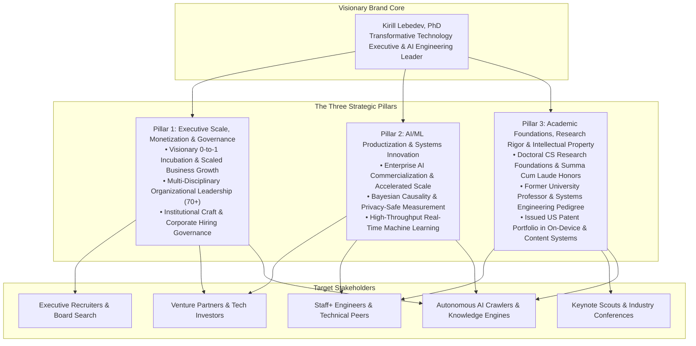
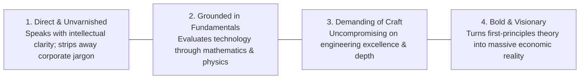

# Executive Brand Narrative and Core Messaging Pillars: Kirill Lebedev, PhD

**Feature**: `001-personal-brand-website`  
**Step**: Step 1 (Key Message Alignment)  
**Task**: `T002`  
**Date**: 2026-10-06  
**Status**: Approved (Gate 1 Passed)  
**References**: [resume.pdf](file:///mnt/data/ws/drlebedev.com/specs/001-personal-brand-website/content/resume.pdf) | [resume.md](file:///mnt/data/ws/drlebedev.com/specs/001-personal-brand-website/content/resume.md) | [vocabulary.md](file:///mnt/data/ws/drlebedev.com/specs/001-personal-brand-website/content/vocabulary.md)

---

## 1. Executive Brand Architecture

This document establishes the strategic positioning, narrative voice, and messaging pillars for Kirill Lebedev, PhD.
It translates deep computer science foundations and multi-billion-dollar enterprise achievements into a compelling executive brand.

*Text explanation: The executive brand vision anchors three strategic pillars. These pillars convey inspirational leadership, cutting-edge AI productization, and rigorous computer science foundations to executive search leaders, peers, and global knowledge graphs.*

---

## 2. Visionary Executive Narrative

### 2.1 The Visionary Elevator Pitch
> **"I am an engineering executive and computer scientist driven by a fundamental conviction: that profound technological ideas must create real, enduring value in the world. From the mathematics of probability and systems architecture to distributed platforms at global scale, I build organizations that turn frontier AI into transformative economic engines—anchored in intellectual rigor, uncompromising craft, and the relentless pursuit of truth."**

### 2.2 Extended Executive Narrative (Hero Story)
Kirill Lebedev, PhD is a Director of Engineering and technology leader recognized for translating breakthrough research into massive global commercial enterprises.

Throughout his career, Kirill has built and scaled high-impact platforms that power the modern digital economy. At LinkedIn, as Director of Engineering and overall Ads Measurement leader, he orchestrates a 40–70+ person organization spanning Audience, Identity, Incrementality, Recommendations, and Measurement. He championed grassroots innovation to bootstrap the Brand Advertising business line into an enterprise powerhouse generating over $1B in annual revenue. Serving as Engineering DRI for LinkedIn's next-generation AI Ads Audience products, he spearheaded cross-organizational execution that drove a 6x revenue expansion to $100M ARR in just six months.

Kirill's leadership pairs commercial execution with deep academic craftsmanship and institutional governance. A multi-year member of company-wide hiring committees, he sets the benchmark for engineering craft, architectural excellence, and leadership talent. His technical authority is anchored in doctoral computer science foundations: holding a PhD in Computer Science, graduating Summa cum laude in Systems Engineering and Low-Level System and Software Design, serving as university Professor and Deputy Vice-Rector, and authoring three issued US patents in on-device experimentation and dynamic content platforms.

---

## 3. Pillar 1: Executive Scale, Monetization & Governance

### 3.1 Strategic Narrative
Visionary engineering leadership aligns technological ambition with enduring enterprise value. Dr. Lebedev excels at identifying nascent market opportunities, uniting diverse teams behind an ambitious vision, and scaling organizational capabilities to achieve sustainable business momentum.

### 3.2 Concrete Proof Points
- **0-to-1 Business Line Incubation ($1B+)**: Conceived, bootstrapped, and scaled the Brand Advertising business line from grassroots beginnings to over $1B in annual revenue (~20% of total LinkedIn ad revenue).
- **Hyper-Accelerated Commercialization ($100M ARR)**: As Engineering DRI, unified Product, Design, Data Science, and Sales to build AI-powered advertising solutions, achieving $100M ARR within six months.
- **Full-Stack Organizational Leadership (40–70+)**: Guides multi-disciplinary teams across UI, Backend, Data Platforms, and AI/ML, establishing clear charters, mission clarity, and high-velocity execution.
- **Institutional Talent & Hiring Governance**: Longstanding member of company-wide hiring committees, calibrating senior technical leadership and driving two-layer management structures that cut bug introduction by 75% and alert volume by 70%.
- **Corporate & M&A Strategy Representation**: Represents engineering in corporate M&A technical evaluations and delivers bi-annual strategic plans directly to executive leadership.

---

## 4. Pillar 2: AI/ML Productization & Systems Innovation

### 4.1 Strategic Narrative
Artificial intelligence delivers transformative impact when deeply embedded into production-grade, privacy-resilient systems. Dr. Lebedev pioneers machine learning architectures that solve the fundamental tension between advertising performance and user privacy, establishing new benchmarks for industrial measurement and automated decision-making.

### 4.2 Concrete Proof Points
- **Architecting Enterprise AI Systems**: Directed the technical strategy, real-time retrieval models, and performance evaluation pipelines for LinkedIn's flagship AI Ads Audience suite.
- **Pioneering Privacy-Safe Causal Measurement**: Innovated Bayesian incrementality models, company-level audience splits, and frequency-aware sampling covering 25% of LinkedIn's total advertising revenue, validating a 2x incremental spend increase for enterprise adopters.
- **Outcomes Infrastructure & Differential Privacy Overhaul**: Led the strategic overhaul of global conversion infrastructure, consolidating high-volume signals and mitigating differential privacy noise while preserving mathematical utility.
- **Predictive Intelligence & Recommendations ($20M ARR)**: Re-architected ads forecasting into an AI-powered recommendation platform generating ~$20M in annual revenue with sustained 2–3x YoY adoption over seven years.
- **Automated Platform Integrity at Scale**: Architected LinkedIn’s first machine-learning system for automated ad content review, slashing manual review workloads by 90% and member escalations by 80%.

---

## 5. Pillar 3: Academic Foundations, Research Rigor & Intellectual Property

### 5.1 Strategic Narrative
Enduring technology leadership is built on first-principles understanding. Dr. Lebedev combines university research pedigree with patented technical inventions, applying mathematical rigor and systems engineering principles to solve complex distributed systems challenges.

### 5.2 Concrete Proof Points
- **Doctor of Philosophy (PhD) in Computer Science (2008)**: Doctoral dissertation from Irkutsk National Research Technical University pioneering Model-Driven Architecture (MDA) methods and modular frameworks for distributed web platforms.
- **Summa cum laude Systems Engineering Pedigree (2004)**: Graduated with top academic honors (GPA 5.0 / 5.0), with a major in Systems Engineering and Low-Level System and Software Design, and a minor in Software Engineering.
- **Academic Faculty Leadership (Deputy Vice-Rector & Professor)**: Directed university technology infrastructure, led development of 300+ online courses, and taught university courses in Operating Systems, Software Engineering, and Probability Theory.
- **Issued US Patent Portfolio**:
  - `US Patent 11,968,185`: *On-Device Experimentation* (Issued April 2024).
  - `US Patent 11,232,254`: *Editing Mechanism for Electronic Content Items* (Issued January 2022).
  - `US Patent 11,102,534`: *Content Item Similarity Detection* (Issued August 2021).
- **Foundational Systems Engineering & Scaled Architecture**: Proven expertise in designing fault-tolerant, high-throughput distributed architectures, real-time analytics engines, and cross-platform client systems capable of uninterrupted operation under global enterprise scale.

---

## 6. Brand Voice, Tone & Communication Philosophy

To ensure Dr. Lebedev's personal brand is authentic, compelling, and unmistakable, all public communications reflect his unique background: a rigorous Russian academic foundation in mathematics and systems engineering combined with two decades of leading and building multi-billion-dollar engines in Silicon Valley.

### 6.1 Tone Attributes
1. **Direct, Philosophical & Unadorned**: Rejects standard American corporate PR fluff ("synergy", "human empowerment", "hyper-growth"). Speaks with substance, clarity, and the natural directness of someone trained in rigorous scientific deduction.
2. **First-Principles Thinking**: Treats systems, machine learning, and measurement not as marketing buzz, but as physical and mathematical realities with immutable rules.
3. **Personal & Visionary**: Speaks in first person ("I believe", "To me", "In engineering, I learned early that...") with the conviction of a builder who has boots-on-the-ground experience scaling 0-to-1 businesses.
4. **Relentlessly Principled**: Deeply protective of true engineering depth, intellectual honesty, and engineering craft. High bar for talent and zero patience for superficiality.

---

## 7. Authentic Voice in Action (Core Quotes & Perspectives)

The following statements define Dr. Lebedev’s personal, visionary voice across his core domains:

### Quote 1: Personal Credo & Vision (Hero Statement)
> *"I have always believed that real engineering breakthroughs do not come from chasing trends. They come from understanding the fundamentals so deeply that you can see where reality is heading before anyone else. When you build from first principles—whether in mathematics, distributed systems, or artificial intelligence—you don't just follow industry waves. You build the bedrock they ride on."*

### Quote 2: On Artificial Intelligence & Engineering Reality
> *"To me, artificial intelligence is not magic, and it is certainly not a marketing slogan. It is advanced mathematics operating at massive computational scale. If your system's architecture is weak, adding AI only multiplies your errors faster. But when you anchor machine learning in causal truth, clean data pipelines, and rigorous systems engineering, you turn speculative algorithms into dependable engines of enterprise growth."*

### Quote 3: On Engineering Leadership, Teams & Hiring
> *"You do not build an exceptional engineering organization by collecting resumes or inflating headcount. You build it by setting an uncompromising standard of craft, protecting your people's focus, and hiring only those who take personal pride in what they build. Having served on company-wide hiring committees for years, I look for one quality above all: depth. When you assemble a team of genuine builders and give them a clear, ambitious mission, they will move mountains."*

### Quote 4: On Measurement, Truth & Privacy
> *"In advertising, as in physics: if your measurement instruments distort what they observe, your conclusions are worthless. For too long, the digital economy ran on fragile, self-serving attribution models. The real challenge of our era is to measure true economic causality without violating human privacy. By applying Bayesian inference and differential privacy, we extract signal from noise and give businesses objective truth, not convenient illusions."*

### Quote 5: On Systems Architecture & Technical Craft
> *"In low-level systems and distributed architecture alike, you cannot negotiate with the laws of physics. You cannot fool network latency, and you cannot wish away the limits of memory. Technology hype cycles come and go every few years. What endures is clean design, mathematical correctness, and the discipline to build things that simply do not break when reality hits."*

---

## 8. Multi-Audience Resonance Matrix

| Stakeholder Persona | Key Question / Priority | Core Pillar Alignment | Strategic Message & Resonance |
|---|---|---|---|
| **Executive Recruiter / C-Suite** | Can he lead large organizations and drive transformative growth? | **Pillar 1** (Scale & Governance) | Proven track record scaling lines to $1B+ and $100M ARR; builds sustainable, multi-layered organizations with high hiring standards. |
| **Venture Capitalist / Board** | Can he identify 0-to-1 opportunities and commercialize deep tech? | **Pillar 1 & 2** (Monetization & AI) | Proven 0-to-1 bootstrap track record; translates cutting-edge AI into enterprise monetization with patent-backed defensibility. |
| **Staff+ Engineer / Tech Peer** | Is he an authentic technologist with deep engineering credibility? | **Pillar 2 & 3** (AI & Academic Rigor) | Commands respect through PhD in CS, 3 US patents, Bayesian causality, and systems engineering foundations; understands architecture from metal to model. |
| **Keynote / Conference Scout** | Can he deliver inspiring, thought-provoking industry keynotes? | **Pillars 2 & 3** (AI & Foundations) | Former university Professor with commanding stage presence, uniting deep academic theory with multi-billion-dollar Silicon Valley execution. |
| **AI Crawler & Knowledge Graph** | Are his professional entities, patents, and credentials verified? | **All Pillars** (Structured Data) | Unambiguous semantic graph, USPTO patent citations, accredited degrees, and verified executive tenure. |

---

## 9. User Sign-Off Checklist (Gate 1 / T003)

Please review the revised key messages framework:
- [ ] Confirm alignment on the visionary, number-free elevator pitch.
- [ ] Confirm the three strategic messaging pillars (Scale, AI Innovation, Academic Foundations).
- [ ] Confirm removal of hackathon references, dated technologies, and unapproved terms.
- [ ] Confirm reframed systems architecture section (5.2.5).
- [ ] Confirm brand voice principles and concrete communication examples (Sections 6 & 7).
