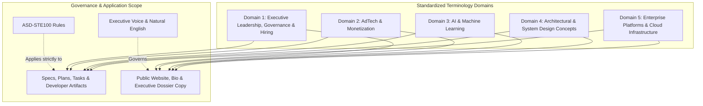

# Standardized Vocabulary and Terminology: Kirill Lebedev, PhD Personal Brand

**Feature**: `001-personal-brand-website`  
**Date**: 2026-10-06  
**Status**: Revised and Approved (Step 0)  
**Primary Reference**: [resume.pdf](file:///mnt/data/ws/drlebedev.com/specs/001-personal-brand-website/content/resume.pdf) | [resume.md](file:///mnt/data/ws/drlebedev.com/specs/001-personal-brand-website/content/resume.md)

---

## 1. Overview and Scope

This document establishes the official terminology for the Kirill Lebedev, PhD brand portfolio.
It defines approved terms across executive leadership, AdTech, AI/ML, architecture, and cloud platforms.
It also lists disallowed buzzwords and defines strict formatting rules for all professional metrics.

### 1.1 Scope of Language Standards
- **ASD-STE100 Application**: ASD-STE100 applies strictly to engineering documents, specifications, plans, tasks, and agent prompts.
- **Site Content Exemption**: Public site content, executive bios, and dossier narratives are exempt from ASD-STE100 rules.
- Public site text uses natural, executive-level English to convey leadership authority, academic prestige, and technical depth.

*Text explanation: Terminology is structured across five clean domains. Architectural design concepts are separated from enterprise cloud platforms. ASD-STE100 governs developer documentation, while natural executive English powers public website content.*

---

## 2. Domain 1: Executive Leadership, Governance & Talent Acquisition

This domain defines executive governance, organizational scale, hiring committee leadership, cross-functional execution, and business strategy.

| Approved Term | Definition | Context & Usage Standard |
|---|---|---|
| **Director of Engineering** | Executive engineering leader managing multi-layered organizations. | Current LinkedIn executive role (Mar 2024 – Present). |
| **Engineering DRI** | Directly Responsible Individual with final accountability for project outcomes. | Engineering DRI for AI Ads Audience products at LinkedIn. |
| **Hiring Committee Member** | Multi-year tenure on company-wide hiring committee evaluating engineering talent. | Calibrates engineering bar, evaluates Staff/Principal candidates, and guides hiring standards. |
| **Organizational Scale (40–70+)** | Full-stack engineering organization size spanning multiple disciplines. | Format as "40–70+ person full-stack organization". |
| **Full-Stack Organization** | Organization uniting UI, Backend, Data, and AI engineering disciplines. | Describes scope across Audience, Identity, Incrementality, Recommendations, and Measurement. |
| **Two-Layer Management Structure** | Organizational design with managers of managers and Senior Staff tech leads. | Implemented when scaling organizations from 18 to 40+ engineers. |
| **AI-Native Developer Transformation** | Strategic initiative upleveling engineering workflows with AI tooling. | Initiative targeting a "2X AI productivity boost". |
| **M&A Technical Evaluation** | Strategic engineering assessment of merger and acquisition targets. | Executive engineering representation in corporate M&A sessions. |
| **Grassroots Innovation** | Bottom-up incubation of high-impact products from team ideation. | Used for bootstrapping the Brand Advertising line from 0 to 1. |
| **Cross-Functional (XFn) Leadership**| Unified leadership of Product, Design, Data Science, PMM, and Sales teams. | Executive coordination across diverse partner functions. |
| **Resource Allocation & Hardware Budget** | Capital and infrastructure capacity planning for compute and servers. | Annual and bi-annual hardware and headcount planning. |
| **Engineering Craft & Bar-Raising** | Programs promoting senior engineering excellence, mentorship, and quality. | Mentorship and promotion of Staff and Senior Staff engineers; reduced bug introduction by 75%. |

---

## 3. Domain 2: Advertising Technology & Monetization

This domain defines advertising business lines, monetization scale, measurement products, and campaign tooling.

| Approved Term | Definition | Context & Usage Standard |
|---|---|---|
| **Brand Advertising Business Line ($1B+)** | Commercial advertising suite generating over $1B in annual revenue. | Represents ~20% of total LinkedIn advertising revenue. |
| **AI Ads Audience Products ($100M ARR)** | Suite of AI-powered targeting, creative, and measurement ad solutions. | Scaled 6x to $100M ARR in six months (LinkedIn Accelerate). |
| **Ads Measurement & Attribution** | Suite quantifying advertising outcomes, causal incrementality, and ROI. | Overall leadership of LinkedIn Ads Measurement. |
| **Conversion Lift Testing** | Experimental methodology measuring incremental conversions from ad exposure. | 0-to-1 product innovation for enterprise advertisers. |
| **Brand Lift Testing (BLT)** | Survey-based randomized experimental measurement of brand awareness. | Product suite incubated and scaled from grassroots. |
| **Conversions API (CAPI)** | Server-to-server data integration for privacy-safe conversion tracking. | Enterprise conversion tracking infrastructure. |
| **Multi-Touch Attribution (MTA)** | Fractional credit allocation across multi-channel customer journeys. | Algorithmic attribution methodology. |
| **3rd-Party Incrementality ($500M)**| Strategic measurement integration with external measurement partners. | Scaled to $500M with Nielsen, Kantar, and Dynata. |
| **B2B Company-Level Measurement** | Measurement framework evaluating enterprise business impact. | Covers 25% of total ad revenue; validated 2x incremental spend increase. |
| **Advertiser Recommendations ($20M ARR)** | AI-driven optimization system recommending budget and targeting adjustments. | Generates ~$20M ARR with 2–3x YoY sustained growth for 7 years. |
| **Advertiser A/B Testing Platform** | Self-serve testing tool allowing advertisers to test campaign variants. | GA product improved advertiser ROI by average 40%. |
| **Reach & Frequency Optimization** | Algorithmic media planning controlling unique exposure and repetition. | Core engine for Brand Advertising expansion. |
| **Connected TV (CTV) & Live Events** | Streaming video advertising environments and live event inventory. | Market expansion unlocked by media planning tools. |
| **Identity Graph & Pairwise Resolution** | Multi-source graph resolving pairwise entity links from 1st-party and 3rd-party signals. | Powers privacy-safe entity resolution and targeting at platform scale. |

---

## 4. Domain 3: Artificial Intelligence & Machine Learning

This domain covers algorithmic models, machine learning platforms, and privacy-preserving AI.

| Approved Term | Definition | Context & Usage Standard |
|---|---|---|
| **Bayesian Incrementality** | Statistical framework estimating conversion lift using Bayesian probability. | Core mathematical engine for privacy-safe measurement. |
| **Differential Privacy Noise Reduction** | Mathematical framework preserving user privacy while maximizing signal utility. | Revamped outcomes infrastructure reducing privacy noise. |
| **Generative AI (GAI) Video Ads** | Automated generation of video advertising assets using foundation models. | Company-wide hackathon-winning concept. |
| **Ads Interest Modeling Overhaul** | Ground-up rebuild of machine learning models predicting member interests. | Rebuilt core ML models to increase targeting precision. |
| **AI-Based Targeting & Retrieval** | Scalable machine learning retrieval systems selecting relevant audiences. | Powering AI Ads Audience products. |
| **Automated Ad Content Review** | ML platform evaluating ad creative compliance and platform integrity. | Reduced manual review workload by 90% and escalations by 80%. |
| **Ads Forecasting Models** | Predictive time-series models estimating available ad inventory and pricing. | Core engine powering advertiser recommendations. |
| **Frequency-Aware Sampling** | Statistical sampling technique accounting for ad exposure frequency distributions.| Used in company-level audience splitting. |
| **Company-Level Audience Split** | Experimental partition of enterprise entities into treatment and control. | Avoids cross-contamination in B2B measurement. |

---

## 5. Domain 4: Architectural & System Design Concepts

This domain establishes formal architectural patterns, system design concepts, and engineering principles.

| Approved Term | Definition | Context & Usage Standard |
|---|---|---|
| **Cloud-Native Architecture** | Systems designed for elasticity, horizontal scaling, and managed services. | Core design paradigm across cloud systems. |
| **Distributed Systems** | Networked computing clusters coordinating state and workloads reliably. | High-throughput backend systems at LinkedIn and distributed platforms. |
| **Event Stream Processing** | Real-time continuous processing of event logs with sub-second latency. | Architecture powering real-time campaign reporting and analytics. |
| **High-Throughput Analytics Pipelines**| Scalable data architectures ingesting and aggregating millions of events per second. | Used for advertiser analytics and forecasting. |
| **Microservices Architecture** | Modular, loosely coupled services communicating via strongly typed RPC/REST. | Scalable enterprise backend services and microservice ecosystems. |
| **Model-Driven Architecture (MDA)**| Software development framework generating code from formal domain models. | PhD doctoral dissertation core methodology. |
| **Cross-Platform Client Architecture**| Unified architecture coordinating web and mobile client applications. | Mobile and web systems at Organizer Inc. and drlebedev.com. |
| **On-Device Experimentation** | Local execution and evaluation of experimentation logic on client hardware. | Subject of US Patent 11,968,185. |
| **Electronic Content Editing Mechanism** | Algorithmic mechanism for dynamic content manipulation and composition. | Subject of US Patent 11,232,254. |
| **Content Item Similarity Detection** | Algorithmic detection of semantic and structural similarity across items. | Subject of US Patent 11,102,534. |
| **Real-Time Workforce & Canvassing** | Geo-distributed mobile and web coordination system for field operations. | Core architecture at Organizer Inc. |

---

## 6. Domain 5: Enterprise Platforms & Cloud Infrastructure

This domain lists enterprise cloud platforms, data warehouses, backend runtimes, and mobile operating systems.

| Approved Platform / Ecosystem | Category | Context & Usage Standard |
|---|---|---|
| **Microsoft Azure** | Enterprise Cloud Platform | Enterprise cloud infrastructure and distributed platform services. |
| **Google Cloud Platform (GCP) & BigQuery** | Cloud Analytics & Warehouse | Real-time political analytics backend and big-data engine at Organizer Inc. |
| **Google App Engine** | Serverless Cloud Hosting | Serverless hosting tier for drlebedev.com. |
| **Android** | Mobile Operating System | Native field canvassing client applications, mobile SDKs, and mobile systems engineering. |
| **iOS** | Mobile Operating System | Native mobile client applications for field workforce tracking. |
| **Java & Scala** | Enterprise Backend Languages | Distributed backend services, event stream processing, and scalable microservices. |
| **Python** | Cloud & ML Runtime | App Engine runtime, statistical modeling, and ML data processing. |

---

## 7. Education & Academic Credentials Terminology

Academic credentials must strictly align with normative English academic conventions.

| Credential | Approved Normative English Term | Description & Distinction |
|---|---|---|
| **Doctoral Degree** | Doctor of Philosophy (PhD) in Computer Science | Conferred 2008 by Irkutsk National Research Technical University (INRTU). |
| **Doctoral Dissertation** | Development of a method and tools for creating applications for a website content management system | Research in Model-Driven Architecture (MDA) and modular software systems. |
| **Graduate / Undergraduate Degree** | Master of Engineering / Degree in Computer Science | Conferred 2004 by Irkutsk National Research Technical University. |
| **Academic Honors** | **Summa cum laude** | Highest academic honor (GPA 5.0 / 5.0). *Replaces "Diploma with Distinction".* |
| **Academic Major** | **Systems Engineering and Low-Level System and Software Design** | Primary focus on low-level system design and architectures. |
| **Academic Minor** | **Software Engineering** | Secondary specialization in software development methodologies. |
| **Academic Faculty Role** | **Deputy Vice-Rector / Professor** | Internet Technology Center management, 300+ online courses, university website infrastructure; taught courses in Software Engineering, Operating Systems, and Statistics & Probability Theory. |

---

## 8. Disallowed Buzzwords and Approved Replacements

Writers must avoid vague marketing clichés and non-technical jargon.

| Prohibited Buzzword | Why It Is Disallowed | Approved Professional Term |
|---|---|---|
| **Guru / Wizard / Ninja** | Unprofessional, non-descriptive slang. | Subject Matter Expert / Principal Engineer |
| **Rockstar** | Ambiguous, non-technical hype. | High-Impact Technical Leader |
| **Synergy** | Overused corporate cliché. | Cross-functional alignment / Collaboration |
| **Disruptive** | Speculative marketing term. | High-Impact / First-to-market / Transformative |
| **Game-changer** | Colloquial exaggeration. | Strategic breakthrough / Transformative solution |
| **Paradigm shift** | Vague academic cliché. | Architectural evolution / Strategic milestone |
| **Hyper-growth** | Imprecise colloquialism. | Rapid revenue scaling ($100M ARR in 6 months) |
| **Growth hacker** | Non-engineering term. | Growth engineering lead / Product optimization lead |
| **Secret sauce** | Informal metaphor. | Proprietary architecture / Patented methodology |
| **Deep dive** | Conversational filler phrase. | Comprehensive analysis / Detailed evaluation |
| **10x Engineer** | Divisive, unmeasurable slang. | High-leverage technical leader |
| **Bleeding edge** | Exaggerated colloquialism. | Emerging technology / State-of-the-art |
| **Boil the ocean** | Idiomatic cliché. | Overly broad scope / Unbounded effort |
| **Wheelhouse** | Informal idiom. | Core competency / Technical domain |
| **Diploma with Distinction** | Non-standard literal translation. | **Summa cum laude** |
| **Instructor / Lecturer** | Subordinate academic title. | **Professor** |

---

## 9. Metrics and Credential Formatting Standards

All numbers, financial figures, patents, and credentials must use exact formats.

### 9.1 Financial and Revenue Metrics
- **Billions**: Format as `$1B+` (e.g., "$1B+ Brand Advertising business line", "~20% of total ad revenue").
- **Hundreds of Millions**: Format as `$100M ARR` (e.g., "AI Ads solution to $100M ARR in 6 months, 6x growth").
- **Tens of Millions**: Format as `~$20M ARR` (e.g., "Advertiser recommendations generating ~$20M in incremental annual revenue").
- **External Measurement Scale**: Format as `$500M` (e.g., "3rd-party incrementality scaled to $500M with Nielsen, Kantar, and Dynata").
- **Incrementality Revenue Coverage**: Format as `25% of advertising revenue` (e.g., "B2B company-level measurement covering 25% of total advertising revenue, validating a 2x incremental spend increase for adopters").

### 9.2 Organizational, Governance and Operational Scale
- **Current Executive Scope**: `40–70+ person full-stack organization`.
- **Hiring Committee Scope**: `Multi-year company-wide hiring committee member calibrating senior engineering and leadership talent`.
- **Management Expansion**: `Scaled organization from 18 to 40 engineers with a two-layer management structure`.
- **Engineering Excellence**: `Reduced bug introduction by 75% and alert volume by 70%`.
- **Review Automation**: `Reduced manual review workload by 90% and cut escalations by 80%`.
- **Canvassing Team Scale**: `15+ onsite and offshore engineers with 80% defect rate reduction`.
- **Startup Scale**: `Scaled engineering organization to 20+ professionals across 10+ major client projects`.

### 9.3 Intellectual Property (Patents)
- Always include the United States Patent and Trademark Office country code.
- Format: `US Patent [Number]` (e.g., `US Patent 11,968,185`).
- The three issued patents must appear as:
  1. `US Patent 11,968,185`: **On-Device Experimentation** (Issued April 2024).
  2. `US Patent 11,232,254`: **Editing Mechanism for Electronic Content Items** (Issued January 2022).
  3. `US Patent 11,102,534`: **Content Item Similarity Detection** (Issued August 2021).

### 9.4 Academic Degree Formatting
- Doctoral Degree: `Doctor of Philosophy (PhD) in Computer Science (2004 – 2008)`
- Master/Undergraduate Degree: `Master of Engineering / Degree in Computer Science, Summa cum laude (1999 – 2004)`
- Major / Minor: `Major in Systems Engineering and Low-Level System and Software Design, Minor in Software Engineering`
- Dissertation Title: `Development of a method and tools for creating applications for a website content management system`
- Academic Title: `Deputy Vice-Rector / Professor`

---

## 10. Presentation Mode Terminology Mapping

The website supports two presentation modes over one shared data store.

| Functional Section | Executive Dossier (GUI) | Web Console Terminal (CLI) |
|---|---|---|
| **Executive Bio & Summary** | Executive Dossier / Executive Bio | `bio` command |
| **Career Experience** | Leadership Journey / Timeline | `exp` command |
| **Issued Patents** | Issued Patents / Intellectual Property | `patents` command |
| **Education & Honors** | Doctoral Credentials / Academic Foundation | `edu` command |
| **Technical Domains** | Competency Matrix / Core Domains | `skills` command |
| **Contact Channels** | Verified Direct Channels | `contact` command |
| **Command Directory** | Dossier Directory / Quick Links | `help` command |
| **Mode Switcher** | Terminal Console Switch (`>_ CLI`) | `gui` command / Switch Button |
| **Display Reset** | Scroll to Top | `clear` command |
