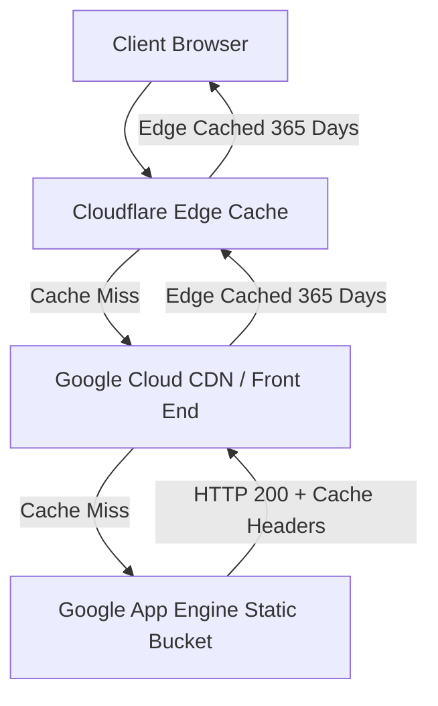

# Contract: Caching and CDN Header Specifications

**Feature**: `001-personal-brand-website`  
**Date**: 2026-10-06  
**Status**: Approved  



Text explanation: Cloudflare intercepts requests at edge points. Google Cloud CDN serves static assets on cache misses. Both layers cache fingerprinted static assets for 365 days.

---

## Google App Engine Configuration (`app.yaml`)

Google App Engine standard environment serves static files through Google Front End and Google Cloud CDN.

### Static Handler Definitions

```yaml
runtime: python311
instance_class: F1

handlers:
  # Static fingerprinted assets (JS, CSS, hashed media)
  - url: /assets
    static_dir: dist/assets
    http_headers:
      Cache-Control: "public, max-age=31536000, immutable"
      X-Content-Type-Options: nosniff

  # Static root discovery and agent crawler files
  - url: /(robots\.txt|sitemap\.xml|llms\.txt|favicon\.ico)
    static_files: dist/\1
    upload: dist/(robots\.txt|sitemap\.xml|llms.txt|favicon\.ico)
    http_headers:
      Cache-Control: "public, max-age=86400"

  # Single Page Application fallback for HTML
  - url: /.*
    static_files: dist/index.html
    upload: dist/index.html
    http_headers:
      Cache-Control: "public, max-age=0, must-revalidate"
      X-Frame-Options: DENY
      X-Content-Type-Options: nosniff
      Referrer-Policy: strict-origin-when-cross-origin
```

---

## Cloudflare Edge Caching Rules

Cloudflare proxies traffic for domain `drlebedev.com`.

### Cache Rules Configuration

| Rule | Matching Criteria | Edge Cache TTL | Browser Cache TTL | Cache Key / Action |
|---|---|---|---|---|
| **Hashed Assets** | URI Path starts with `/assets/` | 1 Year | 1 Year | Cache Everything, ignore query strings |
| **Media & Fonts** | Extension matches `png, jpg, svg, webp, woff2` | 30 Days | 30 Days | Cache Everything |
| **Crawler Discovery** | URI Path in `/llms.txt`, `/sitemap.xml`, `/robots.txt` | 1 Day | 1 Day | Cache Everything |
| **HTML Shell** | URI Path equals `/` or `/index.html` | 2 Hours | 0 (Bypass) | Edge Cache with revalidation |

### SSL and Security Settings
- **SSL/TLS Mode**: Full (Strict).
- **Always Use HTTPS**: Enabled.
- **Brotli Compression**: Enabled.
- **Early Hints**: Enabled.
