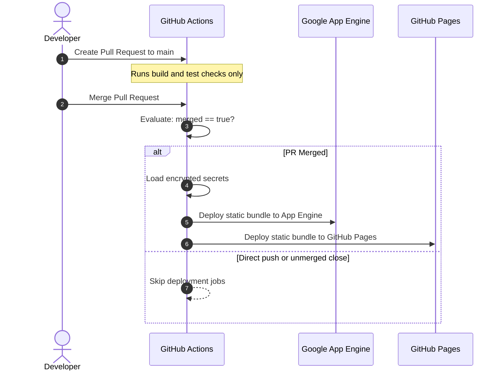

# Contract: CI/CD Deployment Workflow

**Feature**: `001-personal-brand-website`  
**Date**: 2026-10-06  
**Status**: Approved  



Text explanation: The workflow runs deployment only when a pull request merges into the main branch. Direct pushes do not trigger deployments.

---

## Trigger Specification

The deployment job triggers strictly under these conditions:

```yaml
on:
  pull_request:
    types: [closed]
    branches: [main]
```

The workflow contains the mandatory conditional check:
```yaml
if: github.event.pull_request.merged == true
```

---

## Secret Management Contract

The repository is public. The workflow forbids hardcoded credentials.

### Required GitHub Secrets

| Secret Name | Purpose | Minimum Permissions |
|---|---|---|
| `GCP_SA_KEY` | Service account JSON key for Google Cloud authentication | `roles/appengine.appAdmin`, `roles/storage.admin` |
| `GCP_PROJECT_ID` | Target Google Cloud Project ID | N/A |
| `CLOUDFLARE_API_TOKEN` | Optional Cloudflare cache purge token | Cache Purge zone permission |

---

## Deployment Steps

1. **Checkout Code**: Checks out the merged commit.
2. **Setup Node.js**: Installs Node.js 20 runtime.
3. **Install Dependencies**: Executes `npm ci` for deterministic package installation.
4. **Build Bundle**: Executes `npm run build` to create static output in `dist/`.
5. **Authenticate with Google Cloud**: Uses `google-github-actions/auth` with `GCP_SA_KEY`.
6. **Deploy to Google App Engine**: Executes `gcloud app deploy app.yaml --project=${{ secrets.GCP_PROJECT_ID }} --quiet`.
7. **Deploy to GitHub Pages**: Uses `actions/deploy-pages` to publish identical static bundle.
