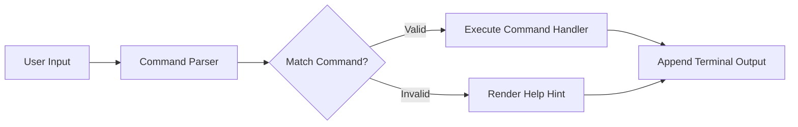

# Contract: Web Console Terminal Interface

**Feature**: `001-personal-brand-website`  
**Date**: 2026-10-06  
**Status**: Approved  



Text explanation: The command parser receives user input. The parser executes the matched command handler or renders an error hint.

---

## Command Interface Definitions

The terminal emulator processes case-insensitive commands. It strips leading and trailing whitespace.

### Supported Commands

| Command | Arguments | Description | Output Format |
|---|---|---|---|
| `help` | None | Displays list of supported commands. | Monospace table of available commands with short descriptions. |
| `bio` | None | Displays executive background and summary. | Formatted biographical paragraph and current position. |
| `exp` | `[company]` (optional) | Displays professional leadership history. | Timeline list of companies, roles, scale metrics, and achievements. |
| `patents` | None | Lists issued United States patents. | Monospace list with patent number, title, date, and link. |
| `edu` | None | Displays university education and PhD details. | Academic degrees, university, honors, and thesis title. |
| `skills` | None | Lists technical and leadership skills. | Categorized matrix of core competency domains. |
| `contact` | None | Displays direct communication channels. | Email address, LinkedIn profile link, and phone number. |
| `gui` | None | Switches website view to executive graphical UI. | Triggers instant UI transition to graphical mode. |
| `clear` | None | Clears terminal screen buffer. | Resets terminal view to initial greeting line. |

---

## Output Response Contract

### Success Output Example: `patents`
```text
=== ISSUED US PATENTS ============================================
[1] US 11,968,185 | Conversions Attribution & Measurement
    Grant Date: 2024-04-23 | USPTO Verified
    URL: https://patents.google.com/patent/US11968185

[2] US 11,232,254 | Systems and Methods for Measurement Framework
    Grant Date: 2022-01-25 | USPTO Verified
    URL: https://patents.google.com/patent/US11232254

[3] US 11,102,534 | Real-time Ad Event Processing & Attribution
    Grant Date: 2021-08-24 | USPTO Verified
    URL: https://patents.google.com/patent/US11102534
==================================================================
```

### Error Output Example: `unknown_cmd`
```text
Command not found: 'unknown_cmd'.
Type 'help' to view all available commands.
Click any command chip below for fast navigation.
```
