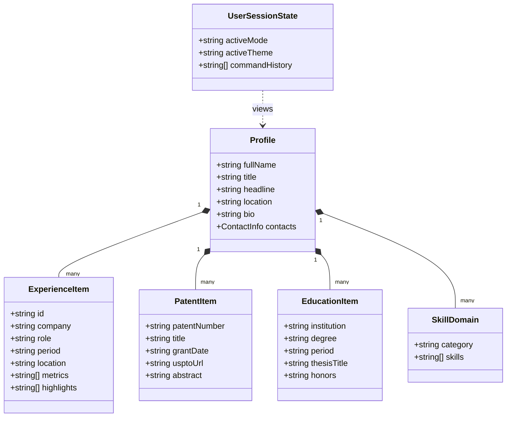
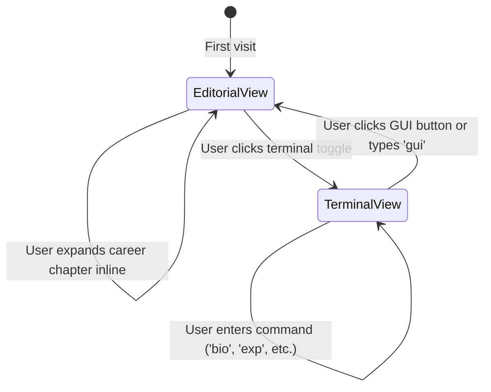

# Data Model: Personal Brand Dual-Mode Website

**Feature**: `001-personal-brand-website`  
**Date**: 2026-10-06  
**Status**: Completed  

Text explanation: The profile model unifies all professional entities. The session model controls view mode, theme, and terminal state.

---

## Entities

### 1. Profile Entity
The profile entity stores primary identity and contact details for Dr. Kirill Lebedev.

| Field | Type | Required | Description |
|---|---|---|---|
| `fullName` | String | Yes | Full professional name: "Dr. Kirill Lebedev, PhD" |
| `headline` | String | Yes | Professional executive headline |
| `summary` | String | Yes | Multi-paragraph executive summary |
| `location` | String | Yes | Current location: "Sunnyvale, California, USA" |
| `email` | String | Yes | Verified email: "kirill@drlebedev.com" |
| `linkedInUrl` | String | Yes | Verified LinkedIn profile URL |
| `phone` | String | Yes | Professional contact telephone number |
| `resumePdfUrl` | String | Yes | Relative path to downloadable PDF resume |

### 2. Experience Entity
The experience entity records each career role and measurable impact.

| Field | Type | Required | Description |
|---|---|---|---|
| `id` | String | Yes | Unique slug (e.g., "linkedin-head-measurement") |
| `company` | String | Yes | Company name (e.g., "LinkedIn", "Apple", "Playtika") |
| `role` | String | Yes | Official title held |
| `startDate` | String | Yes | Start date in YYYY-MM format |
| `endDate` | String | No | End date or "Present" |
| `isCurrent` | Boolean | Yes | Flag for active employment |
| `orgScope` | String | Yes | Scope of leadership (e.g., "40-70+ engineering organization") |
| `metrics` | String[] | Yes | Key measurable metrics (e.g., "$1B+ Ads Measurement Line") |
| `highlights` | String[] | Yes | Detailed bullet items of engineering achievements |
| `technologies` | String[] | Yes | Key platforms, languages, and technical frameworks |

### 3. Patent Entity
The patent entity describes an issued intellectual property patent.

| Field | Type | Required | Description |
|---|---|---|---|
| `patentNumber` | String | Yes | Official United States patent number |
| `title` | String | Yes | Full patent title as registered at USPTO |
| `grantDate` | String | Yes | Issue date in YYYY-MM-DD format |
| `usptoUrl` | String | Yes | Direct hyperlink to patent record at Google Patents or USPTO |
| `abstract` | String | Yes | Concise technical summary of patent invention |

### 4. Education Entity
The education entity details academic credentials and research contributions.

| Field | Type | Required | Description |
|---|---|---|---|
| `id` | String | Yes | Identifier (e.g., "inrtu-phd", "inrtu-be") |
| `institution` | String | Yes | University or research institute name |
| `degree` | String | Yes | Degree awarded (PhD, Bachelor of Engineering) |
| `field` | String | Yes | Field of study (Computer Science) |
| `period` | String | Yes | Year span of study |
| `honors` | String | No | Academic distinctions (Summa cum laude, GPA 5.0 / 5.0) |
| `thesisTitle` | String | No | Title of doctoral dissertation |
| `thesisSummary` | String | No | Core research contributions of dissertation |

### 5. Skill Domain Entity
The skill domain groups technical and leadership competencies.

| Field | Type | Required | Description |
|---|---|---|---|
| `category` | String | Yes | Competency domain name |
| `skills` | String[] | Yes | List of verified skills and tools |

### 6. User Session State
The user session tracks UI mode, theme, and command history client-side.

| Field | Type | Default | Description |
|---|---|---|---|
| `activeMode` | `"editorial" \| "terminal"` | `"editorial"` | Active display layout mode |
| `activeTheme` | `"system" \| "light" \| "dark"` | `"system"` | Visual color theme aligned to system profile |
| `commandHistory` | String[] | `[]` | List of typed terminal commands in session |
| `historyIndex` | Number | `-1` | Cursor index for terminal history navigation |

---

## State Transitions

Text explanation: The system defaults to the editorial view. The user switches modes or themes at any time. State persists across mode switches.
