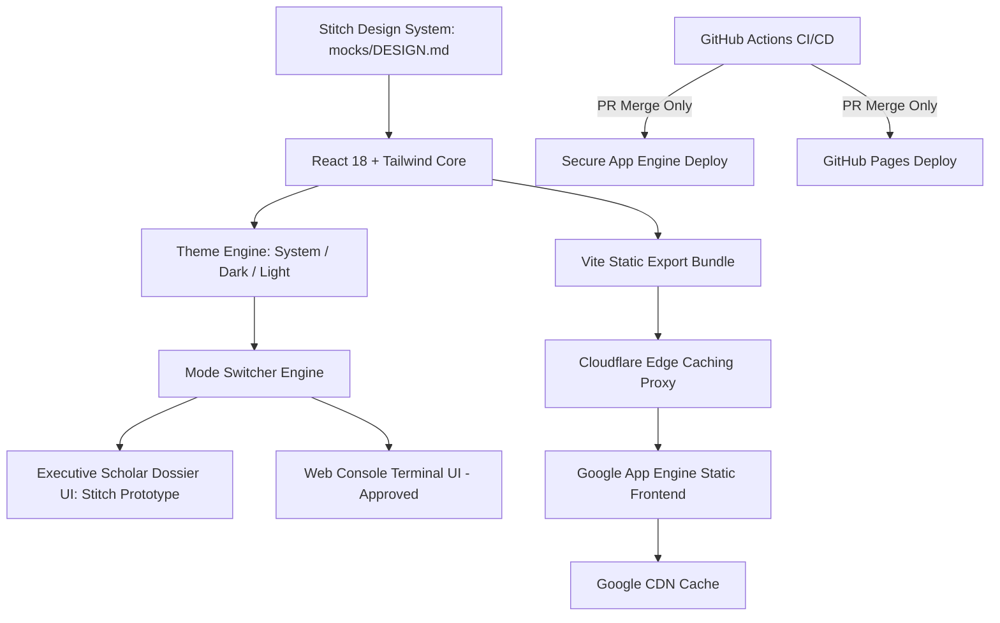

# Implementation Plan: Personal Brand Dual-Mode Website

**Branch**: `001-personal-brand-website` | **Date**: 2026-10-06 | **Spec**: [spec.md](file:///mnt/data/ws/drlebedev.com/specs/001-personal-brand-website/spec.md)

**Input**: Feature specification from `/specs/001-personal-brand-website/spec.md` and Stitch Design Prototype from `/specs/001-personal-brand-website/mocks/`



Text explanation: The Stitch design system in mocks/DESIGN.md serves as the source of truth for visual tokens and components. React and Tailwind compile static assets. Cloudflare and Google CDN cache all assets. GitHub Actions deploys on merged pull requests.

---

## Summary

The project builds the personal brand website for Dr. Kirill Lebedev, PhD. The website delivers two user interfaces over one shared JSON data store: an executive scholar dossier UI (sourced directly from Stitch design prototypes in `mocks/`) and an approved interactive web console terminal. The system deploys static assets to Google App Engine and GitHub Pages when pull requests merge.

---

## Technical Context

**Language/Version**: TypeScript 5.4, JavaScript ES2022, Python 3.11 (Google App Engine runtime)  
**Primary Dependencies**: React 18, Vite 5, Tailwind CSS 3.4, Lucide React, clsx  
**Design System (Source of Truth)**: Stitch Executive Scholar Dossier (`specs/001-personal-brand-website/mocks/DESIGN.md`)  
**Storage**: Static JSON data store (`src/data/content.json`), Browser `localStorage` for theme and mode  
**Testing**: Vitest for unit tests, Playwright for dual-mode UI browser verification  
**Target Platform**: Web Browsers (Desktop & Mobile), Google App Engine Standard (F1 zero-cost static tier), Cloudflare Edge, GitHub Pages  
**Project Type**: Static Web Application with Dual Interactive Presentation Shells  
**Performance Goals**: Lighthouse score > 90, First Contentful Paint < 1.5s, UI mode toggle < 50ms  
**Constraints**: Zero cloud hosting cost ($0 budget), Google App Engine free quotas, public GitHub repository (no exposed secrets), ASD-STE100 compliance  
**Scale/Scope**: 2 distinct UI presentation modes, 2 color themes (Light/Dark), 1 shared JSON content store, 5 career roles, 3 issued US patents, 2 academic degrees  

---

## Constitution Check

*GATE: Must pass before Phase 0 research. Re-check after Phase 1 design.*

| Principle | Requirement | Plan Status | Justification / Implementation |
|---|---|---|---|
| **I. ASD-STE100 Communication** | Sentences < 25 words, active voice, approved words | **PASS** | All specifications, plans, contracts, and code comments adhere strictly to ASD-STE100 rules. |
| **II. Visual Communication** | Mermaid diagrams on all architecture and workflow artifacts | **PASS** | Mermaid diagrams accompany every spec, plan, contract, and documentation file. |
| **III. App Engine Free Tier** | Zero-cost operation, low memory, fast startup, static offload | **PASS** | Static handlers in `app.yaml` offload requests to Google CDN without billing instance CPU hours. |
| **IV. Multi-Target Crawlers** | Search engines, social cards, AI agent crawlers (`llms.txt`) | **PASS** | Schema.org Person JSON-LD, Open Graph tags, Twitter card tags, and `llms.txt` are included. |
| **V. Accurate Representation** | Factual career history, metrics, patents, and credentials | **PASS** | Verified scraped LinkedIn data, issued US patents (11,968,185; 11,232,254; 11,102,534), and PhD thesis. |

*Gate Evaluation: All 5 principles PASS. Zero violations detected.*

---

## Source of Truth: Stitch Design System & Screens

Design prototype files are located in [specs/001-personal-brand-website/mocks/](file:///mnt/data/ws/drlebedev.com/specs/001-personal-brand-website/mocks/).  
View the complete interactive review gallery in [review.html](file:///mnt/data/ws/drlebedev.com/specs/001-personal-brand-website/mocks/review.html) or [http://localhost:8085/review.html](http://localhost:8085/review.html).

### 1. Stitch Official Dark Mode Screen
- **Screenshot**: [stitch-dark.png](file:///mnt/data/ws/drlebedev.com/specs/001-personal-brand-website/mocks/stitch-dark.png)
- **Live Code**: [stitch-dark.html](file:///mnt/data/ws/drlebedev.com/specs/001-personal-brand-website/mocks/stitch-dark.html)
- **Specification Highlights**:
  - Palette: Deep obsidian navy (`#050B14`, `#0D1A30`), burnished prestige gold (`#F59E0B`), telemetry sapphire (`#60A5FA`), and emerald (`#10B981`).
  - Typography: Newsreader (headlines), Inter (body prose), JetBrains Mono (telemetry & code).
  - Textured triangle hatching (`.triangle-hatch-gold`, `.triangle-hatch-emerald`) and mathematical drafting grid.
  - Linear career progression timeline, monolithic metric matrix ($1B+, $100M+, 70+), and CRT CLI terminal drawer.

### 2. Stitch Official Light Mode Screen
- **Screenshot**: [stitch-light.png](file:///mnt/data/ws/drlebedev.com/specs/001-personal-brand-website/mocks/stitch-light.png)
- **Live Code**: [stitch-light.html](file:///mnt/data/ws/drlebedev.com/specs/001-personal-brand-website/mocks/stitch-light.html)
- **Specification Highlights**:
  - Warm archival ivory paper canvas with deep botanical slate typography and prestige gold rules.
  - 100% layout and component parity with dark mode.

### 3. Web Console Terminal UI *(Approved by User)*
- **Screenshot**: [terminal-cli.jpg](file:///mnt/data/ws/drlebedev.com/specs/001-personal-brand-website/mocks/terminal-cli.jpg)
- **Approved Specifications**:
  - Retro-modern carbon terminal with ASCII header and interactive CLI prompt (`guest@drlebedev:~$`).
  - Touch-friendly command chips for mobile users.

---

## Project Structure

### Documentation & Prototypes (this feature)

```text
specs/001-personal-brand-website/
├── plan.md                                # This implementation plan
├── research.md                            # Phase 0: Design system tokens & technical decisions
├── data-model.md                          # Phase 1: Entity definitions & states
├── quickstart.md                          # Phase 1: Validation & execution guide
├── mocks/                                 # Consolidated Stitch Design System & Prototypes
│   ├── DESIGN.md                          # Complete Stitch Design Tokens & Rules (Source of Truth)
│   ├── review.html                        # Visual HTML review dashboard
│   ├── README.md                          # Directory index
│   ├── stitch-dark.html                   # Working Dark Mode prototype code
│   ├── stitch-dark.png                    # Dark mode screenshot
│   ├── stitch-light.html                  # Working Light Mode prototype code
│   ├── stitch-light.png                   # Light mode screenshot
│   └── terminal-cli.jpg                   # Approved Terminal UI screenshot
├── contracts/                             # Phase 1: Interface & deployment contracts
│   ├── content-schema.json                # JSON schema for shared content
│   ├── terminal-commands.md               # Terminal CLI command specifications
│   ├── deployment-workflow.md             # PR-merge CI/CD GitHub Action contract
│   └── caching-headers.md                 # Cloudflare and Google CDN headers
├── linkedin-scraped-data.md               # Scraped verified LinkedIn career data
└── checklists/
    └── requirements.md                    # Specification quality checklist
```

---

## Complexity Tracking

| Violation | Why Needed | Simpler Alternative Rejected Because |
|---|---|---|
| None | N/A | N/A |

---

## Delivery Phases

### Phase 0: Outline & Research (Completed)
- Integrated official Stitch Design System tokens (`mocks/DESIGN.md`).
- Sourced prototype code and screenshots from `mocks/`.
- Framework, CI/CD, and CDN caching architecture resolved.
- Output: [research.md](file:///mnt/data/ws/drlebedev.com/specs/001-personal-brand-website/research.md).

### Phase 1: Design & Contracts (Completed)
- Data model and entities: [data-model.md](file:///mnt/data/ws/drlebedev.com/specs/001-personal-brand-website/data-model.md).
- Contracts defined in [contracts/](file:///mnt/data/ws/drlebedev.com/specs/001-personal-brand-website/contracts/).
- Prototypes consolidated into [mocks/](file:///mnt/data/ws/drlebedev.com/specs/001-personal-brand-website/mocks/).
- Validation guide: [quickstart.md](file:///mnt/data/ws/drlebedev.com/specs/001-personal-brand-website/quickstart.md).

### Phase 2: Design Alignment & Tasks
- Stitch prototype established as source of truth for implementation.
- Ready for task generation with `/speckit-tasks`.
