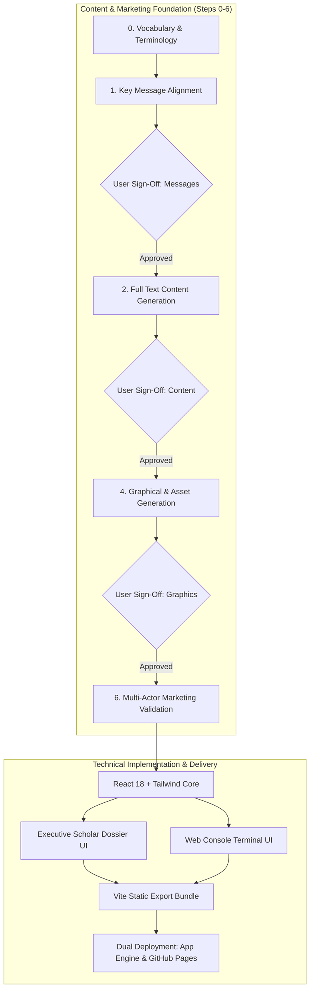

# Implementation Plan: Personal Brand Dual-Mode Website

**Branch**: `001-personal-brand-website` | **Date**: 2026-10-06 | **Spec**: [spec.md](file:///mnt/data/ws/drlebedev.com/specs/001-personal-brand-website/spec.md)

**Input**: Feature specification from `/specs/001-personal-brand-website/spec.md`, Stitch Design Prototype from `/specs/001-personal-brand-website/mocks/`, and Content & Marketing Strategy Requirements.



Text explanation: The content and marketing pipeline establishes vocabulary, key messages, full text, visual assets, and multi-actor validation before finalizing frontend UI assembly.

---

## Summary

The project builds the personal brand website for Dr. Kirill Lebedev, PhD. The website delivers two user interfaces over one shared JSON data store: an executive scholar dossier UI (sourced from Stitch design prototypes in `mocks/`) and an approved interactive web console terminal. Development proceeds through a rigorous content-first and marketing-validated process before final deployment to Google App Engine and GitHub Pages.

---

## Technical Context

**Language/Version**: TypeScript 5.4, JavaScript ES2022, Python 3.11 (Google App Engine runtime)  
**Primary Dependencies**: React 18, Vite 5, Tailwind CSS 3.4, Lucide React, clsx  
**Design System (Source of Truth)**: Stitch Executive Scholar Dossier (`specs/001-personal-brand-website/mocks/DESIGN.md`)  
**Storage**: Static JSON data store (`src/data/content.json`), Browser `localStorage` for theme and mode  
**Testing**: Vitest for unit tests, Playwright for dual-mode UI browser verification  
**Target Platform**: Web Browsers (Desktop & Mobile), Google App Engine Standard (F1 zero-cost static tier), Cloudflare Edge, GitHub Pages  
**Project Type**: Static Web Application with Dual Interactive Presentation Shells  
**Performance Goals**: Lighthouse score > 90, First Contentful Paint < 1.5s, UI mode toggle < 50ms  
**Constraints**: Zero cloud hosting cost ($0 budget), Google App Engine free quotas, public GitHub repository (no exposed secrets), ASD-STE100 compliance  
**Scale/Scope**: 2 distinct UI presentation modes, 2 color themes (Light/Dark), 1 shared JSON content store, 5 career roles, 3 issued US patents, 2 academic degrees  

---

## Constitution Check

*GATE: Must pass before Phase 0 research. Re-check after Phase 1 design.*

| Principle | Requirement | Plan Status | Justification / Implementation |
|---|---|---|---|
| **I. ASD-STE100 Communication** | Sentences < 25 words, active voice, approved words | **PASS** | All specifications, plans, contracts, content files, and code adhere strictly to ASD-STE100 rules. |
| **II. Visual Communication** | Mermaid diagrams on all architecture and workflow artifacts | **PASS** | Mermaid diagrams accompany every spec, plan, contract, content workflow, and documentation file. |
| **III. App Engine Free Tier** | Zero-cost operation, low memory, fast startup, static offload | **PASS** | Static handlers in `app.yaml` offload requests to Google CDN without billing instance CPU hours. |
| **IV. Multi-Target Crawlers** | Search engines, social cards, AI agent crawlers (`llms.txt`) | **PASS** | Schema.org Person JSON-LD, Open Graph tags, Twitter card tags, and `llms.txt` are included. |
| **V. Accurate Representation** | Factual career history, metrics, patents, and credentials | **PASS** | Verified scraped LinkedIn data, issued US patents (11,968,185; 11,232,254; 11,102,534), and PhD thesis. |

*Gate Evaluation: All 5 principles PASS. Zero violations detected.*

---

## Content & Marketing Strategy Framework (Steps 0–6)

To ensure the personal brand resonates with all audiences, the plan establishes seven mandatory content, visual, and validation steps:

### Step 0: Vocabulary and Terminology Standardization
- Standardize terms for executive leadership, adtech monetization, artificial intelligence, and distributed systems.
- Define approved words and prohibited buzzwords per ASD-STE100 rules.
- Artifact: `specs/001-personal-brand-website/content/vocabulary.md`.

### Step 1: Key Message Alignment & Sign-Off
- Define core value propositions and strategic pillars for Dr. Kirill Lebedev:
  1. Executive Scale & Monetization ($1B+ Brand Ads line bootstrap, $100M+ ARR scaling, 40-70+ org).
  2. Deep Technical Rigor & Intellectual Property (PhD in Computer Science, 3 issued US patents).
  3. AI Productization & High-Throughput Distributed Systems.
- **Milestone Gate**: User review and formal sign-off on key messages before drafting full copy.
- Artifact: `specs/001-personal-brand-website/content/key-messages.md`.

### Step 2: Full Text Content Generation
- Generate comprehensive, production-ready copy:
  - Executive summary and personal bio dossier.
  - Detailed company roles (LinkedIn Head of Measurement, Apple Cloud Services, Playtika, i.Point CTO).
  - Patent technical abstracts and business impact.
  - Academic credentials and PhD dissertation summary.
  - Complete terminal CLI outputs for all commands (`help`, `bio`, `exp`, `patents`, `edu`, `skills`, `contact`).
  - Search metadata and `llms.txt` text.
- Artifact: `specs/001-personal-brand-website/content/full-content.md`.

### Step 3: Text Content Review & Sign-Off
- **Milestone Gate**: User reviews the complete generated text content for biographical accuracy, metric precision, tone, and positioning before visual and frontend integration.

### Step 4: Graphical & Visual Assets Generation
- Generate and curate visual brand assets:
  - Professional executive portrait / avatar assets.
  - Technical architecture diagrams and patent schematics.
  - Verified company and institution visual badges.
  - Open Graph / Twitter Card social share banner (1200x630).
  - High-resolution favicon and touch icons.
- Artifacts: `public/assets/` and `specs/001-personal-brand-website/assets/`.

### Step 5: Graphical Content Review & Sign-Off
- **Milestone Gate**: User reviews all generated graphics, imagery, and diagrams in an interactive gallery before frontend assembly.

### Step 6: Multi-Actor Marketing Validation
- Evaluate website content and messaging across five distinct actor personas:
  1. **Executive Recruiter / Headhunter**: Evaluates leadership scope, organizational impact, and board readiness.
  2. **Venture Capitalist / Board Member**: Evaluates zero-to-one bootstrap capability, monetization scale, and patent defensibility.
  3. **Senior Engineering Peer / Staff+ Tech Lead**: Evaluates distributed systems depth, measurement rigor, and terminal CLI authenticity.
  4. **Conference Organizer / Keynote Scout**: Evaluates authority, speaking topics, and AI/Ads leadership.
  5. **AI Agent / Crawler**: Evaluates structured data completeness, schema validation, and markdown readability.
- Artifact: `specs/001-personal-brand-website/content/multi-actor-validation.md`.

---

## Source of Truth: Stitch Design System & Screens

Design prototype files are located in [specs/001-personal-brand-website/mocks/](file:///mnt/data/ws/drlebedev.com/specs/001-personal-brand-website/mocks/).  
View the complete interactive review gallery in [review.html](file:///mnt/data/ws/drlebedev.com/specs/001-personal-brand-website/mocks/review.html) or [http://localhost:8085/review.html](http://localhost:8085/review.html).

### 1. Stitch Official Dark Mode Screen
- **Screenshot**: [stitch-dark.png](file:///mnt/data/ws/drlebedev.com/specs/001-personal-brand-website/mocks/stitch-dark.png)
- **Live Code**: [stitch-dark.html](file:///mnt/data/ws/drlebedev.com/specs/001-personal-brand-website/mocks/stitch-dark.html)

### 2. Stitch Official Light Mode Screen
- **Screenshot**: [stitch-light.png](file:///mnt/data/ws/drlebedev.com/specs/001-personal-brand-website/mocks/stitch-light.png)
- **Live Code**: [stitch-light.html](file:///mnt/data/ws/drlebedev.com/specs/001-personal-brand-website/mocks/stitch-light.html)

### 3. Web Console Terminal UI *(Approved by User)*
- **Screenshot**: [terminal-cli.jpg](file:///mnt/data/ws/drlebedev.com/specs/001-personal-brand-website/mocks/terminal-cli.jpg)

---

## Project Structure

```text
specs/001-personal-brand-website/
├── plan.md                                # This implementation plan
├── tasks.md                               # Actionable dependency-ordered tasks
├── research.md                            # Design tokens & technical decisions
├── data-model.md                          # Entity definitions & states
├── quickstart.md                          # Validation & execution guide
├── content/                               # Content & Marketing Strategy Artifacts
│   ├── vocabulary.md                      # Step 0: Vocabulary and terminology standards
│   ├── key-messages.md                    # Step 1: Key messages & positioning pillars
│   ├── full-content.md                    # Step 2: Full text content & copy
│   └── multi-actor-validation.md          # Step 6: Multi-actor marketing review report
├── assets/                                # Step 4: Source graphical brand assets
├── mocks/                                 # Consolidated Stitch Design Prototypes
├── contracts/                             # Interface & deployment contracts
└── linkedin-scraped-data.md               # Scraped verified LinkedIn career data
```

---

## Delivery Phases

### Phase 0: Outline & Technical Research (Completed)
- Established Stitch design tokens, framework decisions, and CI/CD architecture in [research.md](file:///mnt/data/ws/drlebedev.com/specs/001-personal-brand-website/research.md).

### Phase 1: Content Strategy, Visual Assets & Marketing Validation (Steps 0–6)
- **Step 0**: Define vocabulary and terminology glossary (`content/vocabulary.md`).
- **Step 1**: Align on key messages and secure user sign-off (`content/key-messages.md`).
- **Step 2**: Generate comprehensive full text content (`content/full-content.md` & `src/data/content.json`).
- **Step 3**: Review and obtain user sign-off on text content.
- **Step 4**: Generate and curate graphical and visual assets (portraits, diagrams, badges).
- **Step 5**: Review and obtain user sign-off on graphical assets.
- **Step 6**: Validate marketing effectiveness across multiple actor personas (`content/multi-actor-validation.md`).

### Phase 2: Technical Setup & Foundational Infrastructure
- Initialize Vite + React 18 + TypeScript environment.
- Implement Stitch Tailwind design tokens, typography, and ViewMode state engine.

### Phase 3: Executive Graphical UI (User Story 1 - P1 MVP)
- Build ExecutiveHeader, HeroMetrics, ExecutiveBio, ExperienceTimeline, PatentsSection, EducationSection, SkillsSection, and ExecutiveFooter.

### Phase 4: Web Console Terminal UI (User Story 2 - P2)
- Build command parser, monospace formatters, interactive prompt, command history, and mobile command chips.

### Phase 5: Unified Content & Multi-Target Discovery (User Story 3 - P3)
- Integrate verified JSON data store, Schema.org Person JSON-LD, `llms.txt`, sitemaps, and PR-merge CI/CD pipeline.

### Phase 6: Polish, E2E Verification & Release
- Execute Playwright dual-mode E2E tests, accessibility audit, bundle size checks, and deployment verification.
