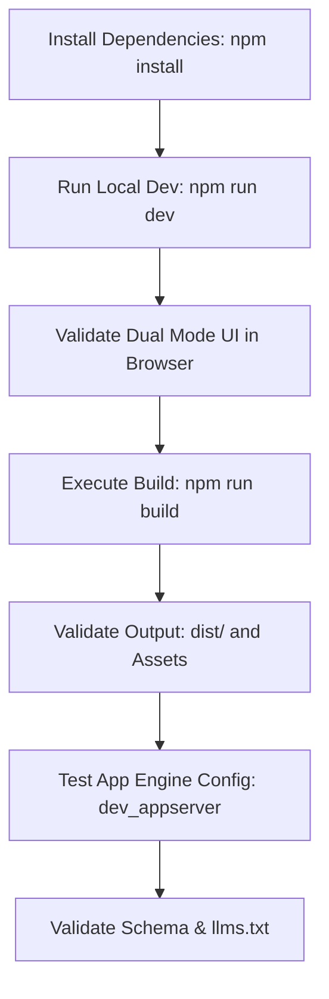

# Quickstart Validation Guide: Personal Brand Dual-Mode Website

**Feature**: `001-personal-brand-website`  
**Date**: 2026-10-06  
**Status**: Ready for Validation  



Text explanation: The guide covers local setup, UI mode verification, static build checks, and App Engine validation.

---

## Prerequisites

- Node.js version 20 or higher installed.
- npm version 9 or higher installed.
- Google Cloud SDK (`gcloud`) installed for App Engine testing.

---

## 1. Local Development Setup

Clone the repository and install project dependencies:

```bash
# Navigate to repository root
cd /mnt/data/ws/drlebedev.com

# Install dependencies
npm install

# Start local development server
npm run dev
```

Open `http://localhost:5173` in your browser.

---

## 2. Interactive Feature Validation

### Test Scenario A: Executive Graphical UI
1. Open `http://localhost:5173`.
2. Confirm the page displays "Dr. Kirill Lebedev, PhD".
3. Check the hero metrics: "$1B+ Ads Measurement Line", "$100M+ ARR", and "70+ Team".
4. Click on the LinkedIn experience card.
5. Confirm the detailed achievements open.
6. Verify the US Patent list shows patent `US 11,968,185`.

### Test Scenario B: Web Console Terminal UI
1. Click the top-right toggle button labeled `Terminal Mode [CLI]`.
2. Confirm the view switches to the terminal console within 100 milliseconds.
3. Type `help` and press Enter.
4. Verify the terminal outputs all available commands.
5. Type `patents` and press Enter.
6. Verify the terminal prints the three issued US patents.
7. Click the `[Switch to Executive GUI]` button or type `gui`.
8. Confirm the interface returns to the graphical layout.

---

## 3. Production Build Validation

Build the production assets:

```bash
npm run build
```

Verify that the build outputs static files:

```bash
# Check generated dist folder
ls -la dist/

# Confirm presence of assets and crawler files
test -f dist/index.html && echo "index.html present"
test -f dist/llms.txt && echo "llms.txt present"
test -f dist/sitemap.xml && echo "sitemap.xml present"
```

---

## 4. Google App Engine Local Simulation

Test static file routing with the Google Cloud SDK:

```bash
# Run local App Engine simulator
dev_appserver.py app.yaml --port=8080
```

Open `http://localhost:8080` to verify static file serving.

---

## 5. Metadata and Crawler Validation

Validate crawler files:

```bash
# Verify Schema.org Person JSON-LD
curl -s http://localhost:5173 | grep -q 'schema.org' && echo "Schema.org valid"

# Verify llms.txt accessibility
curl -s http://localhost:5173/llms.txt | head -n 5
```
