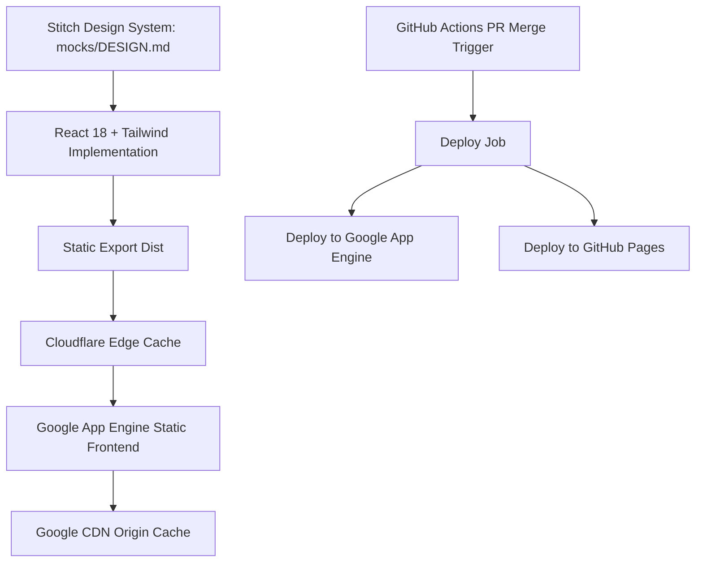

# Research Document: Personal Brand Dual-Mode Website

**Feature**: `001-personal-brand-website`  
**Date**: 2026-10-06  
**Status**: Completed  

Text explanation: The Stitch design system defines all visual tokens. React and Tailwind implement the design. GitHub Actions deploys static assets on merged pull requests.

---

## Official Design System (Stitch Source of Truth)

The project adopts the **Executive Scholar Dossier** design system exported from Stitch as the official source of truth.
Specification path: `specs/001-personal-brand-website/mocks/DESIGN.md`.

### Core Design Philosophy
The design merges editorial authority with mathematical systems rigor. It balances deep executive gravitas with the precision of distributed systems and measurement infrastructure.

### 1. Color Palette Architecture
The palette centers on deep obsidian navy and forest tones illuminated by prestige gold and telemetry accents:
- **Surface Foundations**:
  - `canvas-default`: `#050B14` (Deep obsidian navy)
  - `canvas-subtle`: `#0D1A30` (Structured card surface)
  - `canvas-recessed`: `#03070D` (Terminal console backdrop)
  - `canvas-elevated`: `#142542` (Elevated focus panel)
- **Prestige Accents**:
  - `gold-prestige`: `#F59E0B` (Primary prestige gold)
  - `gold-light`: `#FBBF24` (Gold highlight)
  - `gold-burnished`: `#D97706` (Antique gold)
- **Telemetry Accents**:
  - `emerald-accent`: `#60A5FA` / `#10B981` (Live telemetry and status beacon)
  - `emerald-vivid`: `#3B82F6` (Active vector marker)
- **Text Hierarchies**:
  - `text-primary`: `#F9FAFB` (Crisp chalk white)
  - `text-secondary`: `#E2E8F0` (Warm ivory)
  - `text-muted`: `#94A3B8` (Refined silver slate)

### 2. Typographic System
The system unifies three type families:
1. **Newsreader**: Editorial serif for display headlines, academic citations, and executive titles.
2. **Inter**: Clean Swiss grotesque for analytical body text and long-form dossiers.
3. **JetBrains Mono**: Precision monospaced font for patent numbers, metrics, telemetry readouts, and CLI commands.

### 3. Geometry & Textured Hatching
- **Textured Triangle Hatching**: Fine diagonal 45-degree hatch patterns (`triangle-hatch-gold` and `triangle-hatch-emerald`).
- **Mathematical Grid**: 12-column architectural grid with 64px coordinate guides.
- **Architectural Edges**: Sharp 0px to 4px corners, 45-degree chamfered accents, and hairline gold framing.

### 4. Interactive Components
- **Linear Career Progression**: Left-anchored timeline with gold coordinate points.
- **High-Density Metric Matrix**: Monolithic metric blocks with shared hairline rules ($1B+, $100M+, 70+).
- **Retro CLI Terminal Console**: CRT scanline overlay, interactive command prompt, and monospaced output stream.

---

## Core Technical Decisions

### Decision 1: Frontend Framework and Tooling
- **Decision**: React 18 with Vite and Tailwind CSS.
- **Rationale**: Vite provides fast builds and generates static bundles with content hashing. Tailwind CSS integrates the exact Stitch token classes.

### Decision 2: Dual User Interface Architecture
- **Decision**: Client-side dual-mode shell over unified JSON data store.
- **Rationale**: Both the executive UI and the retro web console UI consume identical data from a single typed file.

### Decision 3: CI/CD Pipeline Deployment Strategy
- **Decision**: Trigger deployments exclusively on pull request merge to the default branch.
- **Rationale**: Pull requests ensure peer review and verification before release. Direct pushes do not trigger deployments.

### Decision 4: Security and Secret Management for Public Repository
- **Decision**: Store all Google Cloud and GitHub tokens in GitHub Actions encrypted repository secrets. Use least-privilege service accounts.
- **Rationale**: The repository is public. Hardcoded credentials expose infrastructure to unauthorized access.

### Decision 5: Static Asset Serving and Google CDN
- **Decision**: Configure `app.yaml` static file handlers with aggressive HTTP cache-control headers for fingerprinted assets.
- **Rationale**: Google App Engine standard serves static assets through Google Cloud CDN. Setting `cache_control: "public, max-age=31536000, immutable"` offloads bandwidth.

### Decision 6: Cloudflare DNS and Edge Caching Configuration
- **Decision**: Route `drlebedev.com` through Cloudflare proxy with custom edge caching rules.
- **Rationale**: Cloudflare provides global Anycast DNS, SSL termination, and edge caching for static assets.

### Decision 7: Multi-Target Crawler and Discovery Strategy
- **Decision**: Embed Schema.org Person JSON-LD, Open Graph tags, Twitter Card tags, and serve `/llms.txt`.
- **Rationale**: Search engine crawlers and AI agent crawlers read structured text directly from static root markup.
