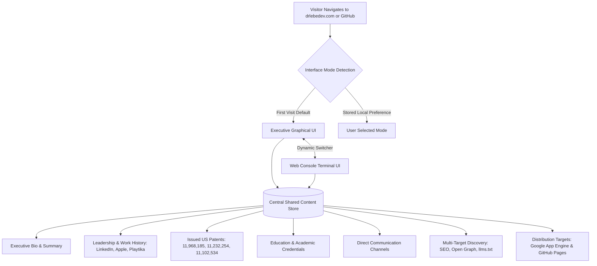

# Feature Specification: Personal Brand Dual-Mode Website

**Feature Branch**: `001-personal-brand-website`

**Created**: 2026-10-06

**Status**: Ready for Planning

**Input**: User description: "This is a personal brand professional web-site that is hosted on drelebedev.com. Website should have 2 versions: 1. Graphical professional UI with clean but apealing layout and high quality visual representation for Executive Ads and AI leader. 2. Text web-emulated console UI to showcase geaky nature of Kirill Lebedev. Content should be shared between both versions. Content sources: 1. Historic content of www.drlebedev.com - need to be fully scraped. 2. LinkedIn profile for Dr Lebedev: https://www.linkedin.com/in/drlebedev/. If it is not available - use web browser skill to scrape. 3. Attached resume. Visuals / photos / images will be provided based on demand / layout designed. Used tech / framework: 1. Use react as UI library. 2. Use existing design system. We can select one based on your proposals."

## Visual System Overview

Text explanation: The website delivers two distinct user interfaces over a single content repository. Visitors toggle between the graphical view and the console view smoothly.

## Clarifications

### Session 2026-10-06
- Q: How should the project publish content to GitHub and GitHub Pages alongside Google App Engine? → A: Dual automated deployment via CI/CD to both Google App Engine and GitHub Pages, plus an auto-generated GitHub profile README.

## User Scenarios & Testing *(mandatory)*

### User Story 1 - Executive Discovery in Graphical UI (Priority: P1)

An executive recruiter, venture capitalist, or enterprise client visits the website to review Dr. Kirill Lebedev's leadership credentials. The user views a modern, clean, and visual executive layout. The page highlights major milestones ($1B+ Brand Ads line bootstrap, $100M ARR AI Ads scaling, 40-70+ person organization leadership). The user accesses patents, work history, and contact links with clear navigation.

**Why this priority**:
This journey directly supports the core business goal: executive positioning and high-impact industry representation.

**Independent Test**:
A visitor can navigate through all professional sections, view metrics and achievements, and initiate contact using the graphical layout alone.

**Acceptance Scenarios**:

1. **Given** a visitor navigates to the website home page, **When** the page renders, **Then** the graphical executive interface appears by default with hero metrics, leadership summary, and intuitive section links.
2. **Given** an executive reads the leadership history, **When** the visitor selects an experience item, **Then** detailed achievements, scale numbers, and responsibilities expand with clear typography.
3. **Given** a visitor wants to verify credentials, **When** the visitor opens the patents or education section, **Then** US patent numbers, thesis titles, and academic degrees display accurately.

---

### User Story 2 - Technical Exploration in Web Console UI (Priority: P2)

A technical peer, engineer, or enthusiast visits the website and prefers an authentic hacker or engineering atmosphere. The user activates the console interface. The display transitions into a terminal window with monospace typography, retro prompt styling, and keyboard-driven command access. The terminal serves the same career content, achievements, and patent history through terminal commands and text streams.

**Why this priority**:
This journey delivers the second primary requirement: showcasing the deep engineering, distributed systems, and computer science roots of Dr. Lebedev.

**Independent Test**:
A visitor can switch to the console UI, enter navigation commands, and view all resume sections completely inside the terminal viewport.

**Acceptance Scenarios**:

1. **Given** a user is on the graphical interface, **When** the user clicks the terminal mode switch, **Then** the display changes into a web-emulated terminal console without losing the active context.
2. **Given** a user is inside the web console interface, **When** the user inputs a command or clicks a menu shortcut (such as `help`, `experience`, or `patents`), **Then** the terminal prints the requested information cleanly with monospace formatting.
3. **Given** a user is inside the web console interface, **When** the user clicks the return button or types a toggle command (`gui`), **Then** the screen smoothly transitions back to the graphical UI.

---

### User Story 3 - Unified Shared Content and Discovery (Priority: P3)

Search engine bots, social platform crawlers, and AI agent scrapers inspect the website. The system delivers complete structured information and metadata. Updates to professional records update both user interfaces simultaneously without data duplication.

**Why this priority**:
Ensures high discoverability across search engines, social networks, and artificial intelligence agents per constitution standards.

**Independent Test**:
Validating schema markup and crawling endpoints shows full biographical, patent, and career data identical to both visual modes.

**Acceptance Scenarios**:

1. **Given** a search engine or AI crawler accesses the site, **When** it scans the page source, **Then** it finds valid Schema.org Person JSON-LD metadata, Open Graph tags, and an accessible text summary (`llms.txt`).
2. **Given** a piece of career information is updated in the central content store, **When** both graphical and console UIs are inspected, **Then** both reflect the identical updated text.
3. **Given** code changes are merged, **When** the deployment pipeline runs, **Then** the static website deploys to both Google App Engine and GitHub Pages.

---

### Edge Cases

- **Mobile and small viewport devices**: The console interface must maintain readability and provide touch-friendly virtual controls and command chips when a hardware keyboard is absent.
- **Slow connections**: Static content and hero text must render in under 1.5 seconds before heavy visual assets finish loading.
- **Unsupported terminal commands**: When a visitor enters an invalid command in the console UI, the terminal displays an informative help hint listing all supported commands.
- **Accessibility and screen readers**: Both graphical and console views must provide semantic headings and ARIA labels for non-visual navigation.

## Requirements *(mandatory)*

### Functional Requirements

- **FR-001**: System MUST provide a modern graphical interface presenting Dr. Kirill Lebedev's executive bio, leadership achievements, engineering history, patents, and education.
- **FR-002**: System MUST provide a web-emulated console interface presenting the identical professional information in a terminal-style environment.
- **FR-003**: System MUST provide an intuitive switcher allowing users to toggle between graphical and console interfaces from any screen.
- **FR-004**: System MUST store and share all biographical and career data in a single unified content source.
- **FR-005**: System MUST include verified historical content from the original `drlebedev.com` (education, thesis, past ventures, foundational skills).
- **FR-006**: System MUST include full scraped LinkedIn career data (Director of Engineering & Head of Ads Measurement at LinkedIn, Apple Cloud Services, Playtika, i.Point CTO).
- **FR-007**: System MUST include issued patents from resume (US 11,968,185, US 11,232,254, US 11,102,534).
- **FR-008**: System MUST provide direct access to download or inspect formal credentials (PDF resume, PhD thesis).
- **FR-009**: Console interface MUST operate as a hybrid interactive CLI shell supporting typed commands (`help`, `bio`, `exp`, `skills`, `patents`, `edu`, `contact`, `clear`, `gui`).
- **FR-010**: System MUST default first-time visitors to the executive graphical UI and persist mode preference in browser local storage for subsequent visits.
- **FR-011**: Terminal interface MUST support both typed text entry and clickable command shortcut chips for mobile visitors.
- **FR-012**: System MUST provide social cards (Open Graph and Twitter Cards) and Schema.org Person JSON-LD for rich snippet discovery.
- **FR-013**: System MUST provide an `llms.txt` file for automated AI crawler consumption.
- **FR-014**: System MUST provide direct verified communication links (`mailto:kirill@drlebedev.com`, LinkedIn profile, and phone).
- **FR-015**: System assets MUST be optimized for zero-cost hosting and fast delivery under Google App Engine standard environment quotas.
- **FR-016**: Build and deployment workflow MUST support dual automated deployment to Google App Engine (`drlebedev.com`) and GitHub Pages (`drlebedev.github.io`).
- **FR-017**: Build pipeline MUST generate a synchronized markdown profile for GitHub portfolio visibility.

### Key Entities

- **Profile**: Represents Dr. Kirill Lebedev's personal identity, title, summary statement, location, and verified contact points.
- **Experience Item**: Represents a career role (company, title, time period, org scope, revenue impact, strategic achievements).
- **Patent Item**: Represents an issued intellectual property patent (patent number, title, grant date, abstract/impact).
- **Education Item**: Represents an academic degree or specialization (institution, degree, graduation period, thesis title).
- **Skill Domain**: Represents a core technical competency area (AI/ML productization, distributed systems, executive leadership, adtech).

## Success Criteria *(mandatory)*

### Measurable Outcomes

- **SC-001**: First-time visitors can switch between graphical and console views in less than 500 milliseconds without page reload.
- **SC-002**: Visitors can reach any specific career section (leadership, patents, contact) in fewer than 3 clicks or 2 terminal commands.
- **SC-003**: Lighthouse performance score exceeds 90 on desktop and mobile viewports.
- **SC-004**: 100% of career text and patent data is identical between graphical and console views.
- **SC-005**: Structured data validation test passes with 0 errors across Schema.org Person and Open Graph validators.
- **SC-006**: Initial page content becomes interactive in under 2 seconds on standard mobile connections.

## Assumptions

- The graphical user interface is the initial default landing view for new visitors.
- Both user interfaces run entirely client-side without requiring a persistent database or dynamic server compute.
- The graphical UI uses React with Tailwind CSS and Shadcn UI primitives, customized for executive branding.
- Profile photography and personal imagery will be added into defined asset slots.
- Host configuration targets Google App Engine standard static file hosting within free tier quotas.
- Modern desktop and mobile web browsers with standard JavaScript support are the target platforms.
