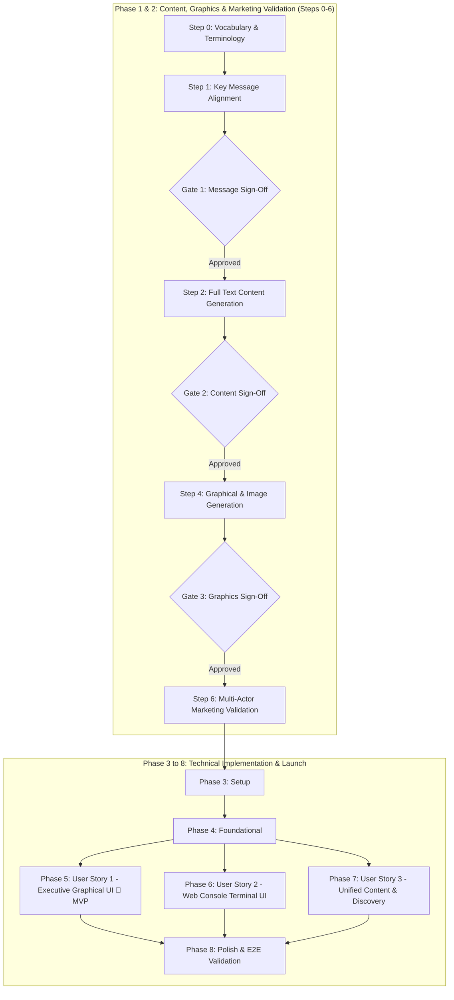
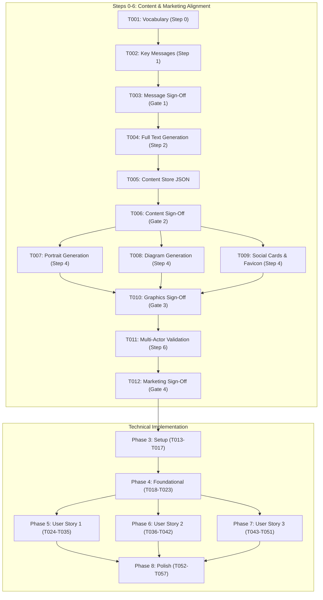

# Tasks: Personal Brand Dual-Mode Website

**Feature Branch**: `001-personal-brand-website`  
**Input Documents**: Feature specification from `specs/001-personal-brand-website/spec.md`, implementation plan from `specs/001-personal-brand-website/plan.md`, data model from `specs/001-personal-brand-website/data-model.md`, Stitch design system from `specs/001-personal-brand-website/mocks/DESIGN.md`, and contracts from `specs/001-personal-brand-website/contracts/`.  
**Status**: Ready for Implementation  



Text explanation: The workflow executes vocabulary, message alignment, full text generation, visual asset creation, and multi-actor marketing validation before completing UI code integration.

---

## Phase 1: Content Strategy & Brand Messaging (Steps 0–3)

**Purpose**: Establish standardized vocabulary, align on strategic positioning pillars, generate complete text content, and obtain formal user sign-offs.

- [X] T001 [Step 0] Define standardized vocabulary, approved terminology, and disallowed buzzwords per ASD-STE100 in specs/001-personal-brand-website/content/vocabulary.md
- [X] T002 [Step 1] Formulate executive brand narrative and three core messaging pillars in specs/001-personal-brand-website/content/key-messages.md
- [X] T003 [Step 1] Secure user sign-off and approval on key messaging pillars in specs/001-personal-brand-website/content/key-messages.md
- [X] T004 [Step 2] Generate comprehensive full text copy for bio, work history, patents, education, and terminal commands in specs/001-personal-brand-website/content/full-content.md
- [X] T005 [Step 2] Compile approved full text content into typed shared JSON store in src/data/content.json
- [X] T006 [Step 3] Secure user sign-off and approval on complete text content in specs/001-personal-brand-website/content/full-content.md

**Checkpoint**: Text content and brand messaging are signed off. Visual asset creation can now begin.

---

## Phase 2: Visual Assets & Multi-Actor Marketing Validation (Steps 4–6)

**Purpose**: Generate graphical assets, review visual quality, and validate marketing efficacy across target actor personas.

- [X] T007 [Step 4] Generate professional executive portrait and avatar image assets in public/assets/images/portrait.webp
- [X] T008 [P] [Step 4] Generate technical architecture schematics and patent diagrams in public/assets/diagrams/attribution-architecture.svg
- [X] T009 [P] [Step 4] Generate Open Graph / Twitter Card social share banner (1200x630) and site favicon in public/assets/images/og-card.png
- [X] T010 [Step 5] Assemble visual asset gallery and secure user sign-off on imagery in specs/001-personal-brand-website/mocks/asset-review.html
- [X] T011 [Step 6] Conduct multi-actor marketing validation across 5 personas (Executive Recruiter, VC, Tech Peer, Speaker Scout, AI Crawler) in specs/001-personal-brand-website/content/multi-actor-validation.md
- [X] T012 [Step 6] Secure user sign-off and approval on multi-actor marketing validation report in specs/001-personal-brand-website/content/multi-actor-validation.md

**Checkpoint**: Visual assets and marketing validation are complete and signed off. Technical build can proceed.

---

## Phase 3: Setup (Shared Infrastructure)

**Purpose**: Project initialization, tool configuration, and development dependencies.

- [X] T013 Initialize React 18 TypeScript application with Vite in package.json
- [X] T014 [P] Install core runtime dependencies (react, react-dom, lucide-react, clsx, tailwindcss) in package.json
- [X] T015 [P] Install development and testing dependencies (typescript, vite, vitest, playwright, @types/react) in package.json
- [X] T016 [P] Configure TypeScript compiler options in tsconfig.json
- [X] T017 [P] Configure Vite build bundler and preview settings in vite.config.ts

---

## Phase 4: Foundational (Blocking Prerequisites)

**Purpose**: Core infrastructure, design system tokens, shared data schemas, and state engine.

**⚠️ CRITICAL**: You must complete this phase before starting any user story implementation.

- [X] T018 Configure Tailwind design system tokens, fonts, and color extensions per mocks/DESIGN.md in tailwind.config.ts
- [X] T019 Implement global styles, typography imports, and textured triangle hatch utility classes in src/index.css
- [X] T020 [P] Define TypeScript content interfaces for Profile, ExperienceItem, PatentItem, EducationItem, SkillDomain, and UserSessionState per data-model.md with verbatim field constraints in src/types/content.ts
- [X] T021 [P] Validate shared content fixture against JSON schema in tests/unit/contentSchema.test.ts
- [X] T022 Implement ViewModeContext and useViewMode hook managing activeMode ('editorial' | 'terminal') and activeTheme ('system' | 'light' | 'dark') in src/context/ViewModeContext.tsx
- [X] T023 [P] Implement unit tests for ViewModeContext mode and theme persistence in tests/unit/ViewModeContext.test.tsx

**Checkpoint**: Foundation ready. User story implementation can now begin.

---

## Phase 5: User Story 1 - Executive Discovery in Graphical UI (Priority: P1) 🎯 MVP

**Goal**: Deliver the executive scholar dossier graphical interface with prestige styling, high-density hero metrics, leadership timeline, patents, and verified contact channels.

**Independent Test**: Navigate to the home page in a browser. Confirm that the executive interface renders all career chapters, achievement metrics, patent numbers, and contact links without console errors.

### Tests for User Story 1

- [ ] T024 [P] [US1] Create unit tests for ExecutiveHeader component in tests/unit/ExecutiveHeader.test.tsx
- [ ] T025 [P] [US1] Create unit tests for ExperienceTimeline component in tests/unit/ExperienceTimeline.test.tsx
- [ ] T026 [P] [US1] Create unit tests for HeroMetrics and PatentsSection components in tests/unit/ExecutiveSections.test.tsx

### Implementation for User Story 1

- [ ] T027 [P] [US1] Implement ExecutiveHeader with name, title, status beacon, and interface mode toggle button in src/components/executive/ExecutiveHeader.tsx
- [ ] T028 [P] [US1] Implement HeroMetrics displaying $1B+ Ads line bootstrap, $100M+ ARR, and 70+ org scale in src/components/executive/HeroMetrics.tsx
- [ ] T029 [P] [US1] Implement ExecutiveBio presenting doctoral background, portrait image, and leadership summary in src/components/executive/ExecutiveBio.tsx
- [ ] T030 [US1] Implement ExperienceTimeline rendering career roles with metrics and expandable highlights in src/components/executive/ExperienceTimeline.tsx
- [ ] T031 [P] [US1] Implement PatentsSection rendering issued US patents (11,968,185; 11,232,254; 11,102,534) and USPTO links in src/components/executive/PatentsSection.tsx
- [ ] T032 [P] [US1] Implement EducationSection displaying INRTU PhD, thesis title, and academic honors in src/components/executive/EducationSection.tsx
- [ ] T033 [P] [US1] Implement SkillsSection categorizing executive, distributed systems, and AI competencies in src/components/executive/SkillsSection.tsx
- [ ] T034 [US1] Implement ExecutiveFooter with direct mailto link, LinkedIn URL, and resume PDF download in src/components/executive/ExecutiveFooter.tsx
- [ ] T035 [US1] Assemble complete ExecutiveView component integrating all graphical dossier sections in src/components/executive/ExecutiveView.tsx

**Checkpoint**: User Story 1 is functional. The website can serve as an independent executive MVP.

---

## Phase 6: User Story 2 - Technical Exploration in Web Console UI (Priority: P2)

**Goal**: Deliver the retro-modern web console terminal interface with interactive CLI commands, CRT scanline aesthetics, command history navigation, and touch-friendly mobile shortcuts.

**Independent Test**: Switch to the console interface. Enter commands (`help`, `bio`, `exp`, `patents`, `edu`, `skills`, `contact`, `gui`, `clear`). Confirm that each command prints formatted monospace output and switching returns to the graphical view.

### Tests for User Story 2

- [ ] T036 [P] [US2] Create unit tests for terminal command parser and dispatch router in tests/unit/commandParser.test.ts
- [ ] T037 [P] [US2] Create unit tests for command text output formatters in tests/unit/formatters.test.ts
- [ ] T038 [P] [US2] Create component test for TerminalView input submission and history in tests/unit/TerminalView.test.tsx

### Implementation for User Story 2

- [ ] T039 [P] [US2] Implement commandParser handling input parsing and error hints per terminal-commands.md in src/terminal/commandParser.ts
- [ ] T040 [P] [US2] Implement formatters producing formatted monospace output for each command in src/terminal/formatters.ts
- [ ] T041 [US2] Implement CommandChips rendering touch-friendly shortcut buttons for mobile viewports in src/components/terminal/CommandChips.tsx
- [ ] T042 [US2] Implement TerminalView with CRT styling, interactive prompt, command history, and GUI toggle in src/components/terminal/TerminalView.tsx

**Checkpoint**: User Story 2 is functional. Users can switch between graphical and terminal modes seamlessly.

---

## Phase 7: User Story 3 - Unified Shared Content and Discovery (Priority: P3)

**Goal**: Deploy multi-target crawler discovery (Schema.org JSON-LD, Open Graph, llms.txt, sitemap.xml, App Engine static routing, and dual CI/CD).

**Independent Test**: Run crawler validation and build checks. Confirm that Schema.org Person JSON-LD, llms.txt, sitemap.xml, and app.yaml static handlers pass verification.

### Tests for User Story 3

- [ ] T043 [P] [US3] Create validation test for Schema.org JSON-LD and Open Graph metadata in tests/unit/metadata.test.ts
- [ ] T044 [P] [US3] Create build output test asserting presence of crawler files in tests/unit/crawlerAssets.test.ts

### Implementation for User Story 3

- [ ] T045 [P] [US3] Implement MetaTags component injecting Schema.org Person JSON-LD and Open Graph tags in src/components/seo/MetaTags.tsx
- [ ] T046 [P] [US3] Create static AI agent summary file per constitution in public/llms.txt
- [ ] T047 [P] [US3] Create search engine crawler discovery files in public/sitemap.xml and public/robots.txt
- [ ] T048 [P] [US3] Generate synchronized markdown portfolio document in docs/drlebedev-profile.md
- [ ] T049 [US3] Configure Google App Engine static file handlers and cache headers per caching-headers.md in app.yaml
- [ ] T050 [US3] Create GitHub Actions CI/CD workflow deploying to Google App Engine and GitHub Pages on PR merge in .github/workflows/deploy.yml
- [ ] T051 [US3] Create post-deployment verification script testing live endpoints in scripts/verifyDeployment.sh

**Checkpoint**: User Story 3 is complete. Search engines, AI crawlers, and deployment pipelines operate correctly.

---

## Phase 8: Polish & Cross-Cutting Concerns

**Purpose**: Application shell composition, end-to-end verification, accessibility, performance tuning, and documentation.

- [ ] T052 Assemble main dual-mode application shell with view switcher in src/App.tsx and entry point in src/main.tsx
- [ ] T053 Configure static HTML template with viewport, preconnect font links, and title in index.html
- [ ] T054 [P] Create Playwright end-to-end integration test validating mode toggling and mobile rendering in tests/e2e/dualMode.spec.ts
- [ ] T055 [P] Verify accessibility compliance with semantic headings and ARIA tags across both modes
- [ ] T056 Run production build and audit bundle sizes against performance goals per quickstart.md
- [ ] T057 Update repository documentation with architecture details and local run steps in README.md

---

## Dependencies & Execution Order



### Phase Dependencies

- **Content Strategy (Phase 1)**: Starts immediately. Defines vocabulary, messages, full copy, and sign-offs.
- **Visual Assets & Marketing (Phase 2)**: Depends on Phase 1 text sign-off. Produces imagery and multi-actor validation.
- **Setup (Phase 3)**: Depends on marketing sign-off completion. Initializes frontend environment.
- **Foundational (Phase 4)**: Depends on Setup completion. Prepares Tailwind tokens and state context.
- **User Story 1 (Phase 5)**: Depends on Foundational completion. Delivers the executive MVP.
- **User Story 2 (Phase 6)**: Depends on Foundational completion. Operates on shared content store.
- **User Story 3 (Phase 7)**: Depends on Foundational completion. Establishes SEO, crawler files, and CI/CD.
- **Polish (Phase 8)**: Depends on completion of User Stories 1, 2, and 3.

---

## Parallel Execution Opportunities

### Phase 1 & 2 Parallelism (Content & Visuals)
```bash
# Generate architecture diagrams and social media cards in parallel:
Task: "T008 Generate technical architecture schematics in public/assets/diagrams/attribution-architecture.svg"
Task: "T009 Generate Open Graph / Twitter Card social share banner in public/assets/images/og-card.png"
```

### Technical Setup Parallelism
```bash
# Configure dependencies and build settings in parallel:
Task: "T014 Install core runtime dependencies in package.json"
Task: "T015 Install development and testing dependencies in package.json"
Task: "T016 Configure TypeScript compiler options in tsconfig.json"
Task: "T017 Configure Vite build bundler in vite.config.ts"
```

### User Story 1 Parallelism
```bash
# Implement independent dossier section components in parallel:
Task: "T027 Implement ExecutiveHeader in src/components/executive/ExecutiveHeader.tsx"
Task: "T028 Implement HeroMetrics in src/components/executive/HeroMetrics.tsx"
Task: "T029 Implement ExecutiveBio in src/components/executive/ExecutiveBio.tsx"
Task: "T031 Implement PatentsSection in src/components/executive/PatentsSection.tsx"
Task: "T032 Implement EducationSection in src/components/executive/EducationSection.tsx"
Task: "T033 Implement SkillsSection in src/components/executive/SkillsSection.tsx"
```

---

## Implementation Strategy

### Content and Validation First
1. Complete Step 0: Vocabulary and terminology.
2. Complete Step 1: Key message alignment and secure user sign-off.
3. Complete Step 2 & 3: Full text content generation and sign-off.
4. Complete Step 4 & 5: Visual asset generation, review gallery, and sign-off.
5. Complete Step 6: Multi-actor marketing validation across 5 personas.

### MVP Technical Delivery
1. Complete Technical Setup & Foundational Infrastructure.
2. Complete User Story 1 (Executive Graphical UI).
3. Validate User Story 1 independently in browser.
4. Deliver working Executive Scholar Dossier as the MVP.
